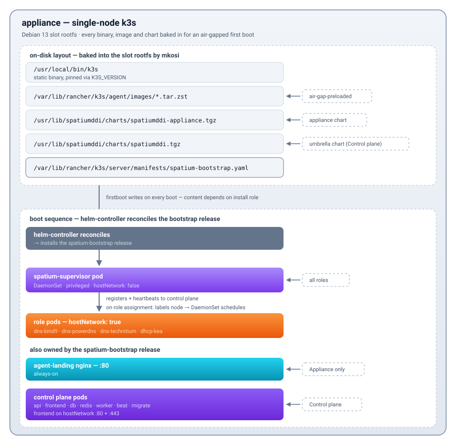

# OS Appliance Deployment Specification

## Overview

SpatiumDDI can be shipped as a **self-contained OS appliance image** — a bootable image where the OS, all services, and the SpatiumDDI application are pre-installed and pre-configured. This allows deployment without any prior OS or container runtime setup: download, boot, configure via web UI, done.

The appliance is **Debian 13 + embedded [k3s](https://k3s.io/)** (a single-binary Kubernetes distribution). SpatiumDDI's container set deploys as k3s HelmChart custom resources — the same umbrella + appliance Helm charts that ship for standalone Kubernetes installs. Operators get a real Kubernetes node without having to install or manage one; release upgrades reconcile through helm-controller, role swaps are single `kubectl label node` calls, and atomic A/B slot upgrades carry both OS and container versions in one unit so they can't drift.

---

## Current architecture (post-#183, 2026-05-17)

The appliance runs **k3s** as its container orchestrator. Pre-#183 it ran `docker-compose` driven from `spatiumddi-firstboot`; that path is gone in every shipped artifact. The historical post-#170 architecture section below documents the docker-compose era for context — it's preserved because most field installs predate #183. For new installs and the current release, start here.

### One-paragraph summary

`spatiumddi-firstboot` writes a HelmChart CR into k3s's auto-deploy directory (`/var/lib/rancher/k3s/server/manifests/`). The k3s-bundled helm-controller picks it up + runs `helm install` from a chart tarball baked into the appliance rootfs (`/usr/lib/spatiumddi/charts/`).

**#272 — two install roles** (the installer wizard collapsed from the earlier three; the old `full-stack` / `frontend-core` distinction is now a runtime DNS/DHCP role toggle, not an install choice — and legacy variant strings are still accepted from a not-yet-reinstalled box):

- **Control plane** (the default; the required FIRST install) — control plane (api / frontend / worker / beat / migrate / Postgres / Redis) + the supervisor, all on a single-node k3s that is also the etcd seed. **DNS + DHCP are OFF at install** — the operator enables them per node from the `/appliance → Fleet` role toggle (so the data plane is always a deliberate fleet decision). The umbrella chart deploys the control plane; the supervisor owns the per-role node labels. More control-plane nodes are made by **promoting** Appliances in the Fleet UI (#272 Phase 7), not installed as this role.
- **Appliance** — supervisor + agent-landing nginx. Pairs against a remote control plane via 8-digit pairing code; roles (`dns-bind9` / `dns-powerdns` / `dns-technitium` / `dhcp`) are assigned post-approval from the control plane's `/appliance → Fleet` tab. Can later be promoted to join the control-plane cluster.

The historical AIO / Core-only / Application narrative below documents the pre-#272 three-role world; the firstboot dispatch still handles those strings as aliases.

<p align="center">
  
</p>

### What's bundled in the slot rootfs

mkosi bakes everything the appliance needs to come up fully air-gapped:

- **k3s static binary** (~70 MB) at `/usr/local/bin/k3s`; `kubectl` / `crictl` / `ctr` symlink to it.
- **k3s airgap images** (CoreDNS / local-path / pause / metrics-server) as zst-compressed tarballs at `/var/lib/rancher/k3s/agent/images/*.tar.zst`. k3s auto-imports them into containerd at boot.
- **SpatiumDDI container images** as zst tarballs at `/usr/lib/spatiumddi/images/`. firstboot imports them into k3s containerd via `ctr -n k8s.io images import`. Includes api / frontend / worker / beat / migrate / dns-bind9 / dns-powerdns / dns-technitium / dhcp-kea / supervisor / nginx + postgres:16-alpine + redis:8.8-alpine for the Control plane role.
- **Helm chart tarballs** at `/usr/lib/spatiumddi/charts/`. The appliance chart drives Appliance installs (and the supervisor on the Control plane); the umbrella chart drives the Control plane. Built at release time + signed.
- **bash-completion + `k` alias** for kubectl — operator SSHing in for triage drops straight into a usable shell.

A fresh appliance boot never reaches out to ghcr.io or any external registry. The first time it does is when an operator explicitly applies a new release through `/appliance → OS Versions` or `/appliance → Releases`.

### Two HelmChart CRs

- **`spatium-bootstrap`** — written by `spatiumddi-firstboot` into k3s's auto-deploy directory on every boot. Content depends on install role (Control plane / Appliance). Owns the always-on resources (supervisor on every role; agent-landing on Appliance; control plane pods on Control plane).
- **`spatiumddi-appliance`** — written by the supervisor on its first successful heartbeat (every role runs a supervisor). Deploys the role DaemonSets (dns-bind9 / dns-powerdns / dns-technitium / dhcp-kea). After #183 Phase 10, this release is installed once and never re-PATCHed for role changes — role swaps happen through node labels (`spatium.io/role-<role>=true`); the DaemonSet's matching-nodes semantics mean an unassigned role produces zero pods rather than a Pending one.

### Why k3s

The pre-#183 docker-compose path fought us on three things every operator-facing release ran into:

1. **Role swaps were brittle.** `docker compose down` of one service + `up -d` of another, with a manual `--env-file` dance, no consistent rollback if a step failed midway. Real recovery was always "delete `/var/lib/spatiumddi/.compose-state`, reboot."
2. **No declarative target.** Compose had no notion of "this appliance should always have N pods of kind X running"; the supervisor's drift checker reimplemented this by parsing `docker compose ps` JSON every 5 min.
3. **A/B slot upgrades had to migrate compose state** across slot rootfs swaps. `/var/lib/docker/` was on `/var` (persistent), but the compose file lived on rootfs, so a new slot could carry a different compose schema while old containers still ran against the old.

k3s solves all three: HelmChart CRs as the declarative target, helm-controller as the reconciler, kine (SQLite) as the state store (survives slot swap because `/var/lib/rancher/` is on `/var`). The supervisor becomes a thin controller that PATCHes node labels per role-assignment change — the role pod schedules or terminates as a consequence of the label, not as a consequence of a `docker compose` invocation.

The trade-off: k3s adds ~70 MB to the slot rootfs and a steady ~150 MB RAM footprint for the k3s server process itself. On the 32 GiB disk floor the appliance targets, both are well under budget.

**Recommended sizing (per role):**

| Role | vCPU | RAM | Disk |
|---|---|---|---|
| **Control plane** (api + worker + frontend + Postgres + Redis + k3s etcd seed) | 4 | 8 GiB | 40 GiB SSD |
| **Appliance** (DNS / DHCP agent) | 2 | 4 GiB | 32 GiB SSD |

The installer's **hard disk floor is 32 GiB** for every role (raised from 24 GiB — issue #312: a 24 GiB disk left `/var` only ~7 GiB, and the Control plane's first boot tipped the kubelet DiskPressure threshold into an eviction storm). 2 GiB RAM boots a single-node control plane but is tight once Postgres + Redis + the Python api/worker are all resident; 8 GiB is the comfortable recommendation. When the operator picks the **Control plane** role on a box below the recommended 40 GiB disk / 8 GiB RAM, `spatium-install` shows a soft sizing warning before proceeding (the lighter Appliance/agent role is fine at the 32 GiB floor and gets no warning). Each control-plane **HA member** sizes the same as a standalone control plane (4 vCPU / 8 GiB) — every member runs a full api / worker / Postgres replica / Redis. SSD is strongly preferred for the etcd + Postgres write path; the installer's disk floor assumes the baked image set lands on the slots, not RAM.

### Appliance management surfaces (k3s-aware)

The `/appliance` section in the SpatiumDDI UI talks to k3s directly via the api pod's mounted ServiceAccount:

- **Cluster tab** (#402 — folds the former Containers/Pods tab + the etcd-snapshots section into one tab via a left sub-nav, named *Cluster* rather than *Kubernetes* for operator clarity). Three sub-sections: **Overview** — a live SSE-fed (2 s) health dashboard (KPI ribbon, CPU / memory hero chart, per-node radial gauges with the host's real partition list, workload-health panel, top-pods leaderboard) built from kubeapi node / pod listings + per-node kubelet `stats/summary` (there is no Prometheus on the appliance); **Pods** — lists every pod in the spatium namespace via kubeapi `GET /api/v1/namespaces/spatium/pods`, restart = `DELETE` the pod (owning Deployment / DaemonSet recreates it), logs = SSE wrapping kubeapi's `?follow=true` pod-log endpoint; **etcd** — the recoverable `ETCDSnapshotFile` inventory.
- **TLS cert manager**. Patches the `spatium-appliance-tls` Secret in place via `kubectl patch secret`. Bumps a checksum annotation on the frontend Deployment to trigger a rollout (k8s doesn't auto-roll on Secret changes — the annotation acts as the trigger).
- **Logs & Diagnostics → Self-test**. Five-check battery: external DNS resolution, kubeapi reachability via the ServiceAccount, every spatium pod's health (Running + healthy / Succeeded Jobs OK), informational DHCP + DNS role presence (OK when not assigned).
- **Diagnostic bundle**. Per-pod log tails (last 500 lines via kubeapi) + host logs + system info + redacted env, zipped for support tickets.
- **OS Versions**. Atomic A/B slot upgrades — same machinery as pre-#183 (Phase 8); the slot raw.xz carries a complete rootfs with k3s + baked images + chart tarballs. A slot upgrade is also an effective container upgrade because images are baked. For an upgrade scheduled from an imported/uploaded image (#199), the download is **verified by the stored sha256** (the integrity guarantee), which lets the host runner relax TLS cert-verify *only* for the appliance's own self-served URL behind the self-signed web cert — external public-CA URLs stay fully verified (#386). The Fleet drilldown shows a **live per-phase progress stepper** (download % → verify → write → bootloader → reboot-pending) with an expandable `slot-upgrade.log` tail and an honest failure card, and a stuck apply re-fires once per distinct desired-state rather than looping (#386). Uploaded/imported image bytes are persisted on a host-path mount so they survive an api restart (#386).

The api pod's ServiceAccount keeps minimal RBAC: namespace-scoped pods + pods/log read, the specific `spatium-appliance-tls` Secret patch, and the frontend Deployment annotation patch. The only cluster-scoped grant is **read-only** `nodes` + `nodes/proxy [get]` (added in #402) so the Cluster Overview dashboard can read per-node kubelet stats. Nothing destructive.

### From-zero operator flow

1. Boot the ISO → installer wizard asks for **role** + target disk + hostname + admin + network + timezone (+ pairing code / control-plane URL on Appliance).
2. Installer partitions (BIOS Boot + ESP + root_A + root_B + var), writes fstab + grub menuentries, runs postinst hardening, reboots.
3. First-boot: `spatiumddi-firstboot` generates `/etc/spatiumddi/.env` with secrets, bakes the self-signed cert, writes the HelmChart bootstrap manifest, starts k3s.
4. k3s comes up + imports baked images + helm-controller installs the bootstrap release. 30-90 s for control plane pods to reach Ready; another 15-30 s for migrate Job to complete schema migrations.
5. Operator browses to `https://<appliance-ip>/`. Until the api is serving, the frontend nginx answers every page with the **"SpatiumDDI is initialising"** page (`frontend/public/_starting.html`, auto-refreshing every 5 s) instead of the SPA shell — `location /` gates on an `auth_request` probe of the api Service, so a cold boot reads as "still coming up" rather than a wall of failed XHRs (#767).
6. Operator accepts the self-signed cert **once** and signs in `admin / admin`, then sets a real password. The cert firstboot minted in step 3 is the only one the operator ever sees: the api's startup bootstrap *adopts* it as the active `appliance_certificate` row rather than generating a rival (#767), so the fingerprint doesn't change mid-boot and the frontend isn't rolled underneath the operator.
7. (Appliance role, or a Control-plane node enabling DNS/DHCP) Operator approves the appliance from the control plane's `/appliance → Fleet` tab + picks roles. DaemonSet schedules role pods within ~30 s.

For a step-by-step user-facing version, see the README's
["Quick start with the OS appliance ISO" section](../../README.md#quick-start-with-the-os-appliance-iso-recommended).

---

## Control-plane high availability (#272)

A fresh install is a one-node control plane. Multi-node HA is built
**by promoting Appliances**, not by a separate installer role — the
operator scales the existing cluster from `/appliance → Fleet →
Manage control plane cluster…`. Full design lives in
[issue #272](https://github.com/spatiumddi/spatiumddi/issues/272);
the reference topologies are in
[`TOPOLOGIES.md`](TOPOLOGIES.md).

### Topology + locked decisions

- **k3s embedded etcd, 3 / 5 / 7 server nodes.** Every node boots
  `cluster-init: true` (a one-member etcd). **Promotion does a full
  cluster-identity reset + rejoin** — wiping only the etcd `db` is not
  enough, the server CA / TLS / node password / flannel subnet all have
  to go too, then the node rejoins the seed via
  `https://<seed-node-ip>:6443` with the Fernet'd join token. The
  host-side runner is `spatium-cluster-join` (etcd backup + rollback +
  a confirmation-marker guardrail so a stray trigger file can't fire a
  destructive wipe). **Even counts (2 / 4) are refused at the API** for
  etcd quorum hygiene.
- **PostgreSQL HA = CloudNativePG.** The operator-managed `Cluster` CR
  is the permanent appliance default (`postgresql.kind=cnpg`); instances
  scale with the committed member count (1 → 3/5/7, primary + streaming
  replicas + automatic failover). The CNPG **operator** pod itself is
  pinned to a small Burstable footprint (`cnpg.resources`: 50m/128Mi
  requests, 500m/512Mi limits) so it isn't the first thing kubelet OOM-
  kills when the all-in-one control node gets tight — an unbounded
  BestEffort operator restart triggers a watched-volume reconciliation
  storm (issue #315). Its startup probe is also loosened to a 60s window
  for slow VMs. Budget ~128 MiB for it when sizing a control node.
- **Redis HA = Sentinel.** Each member pairs a redis-server + a sentinel
  sidecar; app / worker / beat resolve the master via a `sentinel://`
  URL. `sentinel.replicas` scales with the member count.
- **MetalLB, v0.15.3, L2 mode** (air-gap baked: controller + speaker
  only, `frrk8s.enabled=false`; pinned to the full v0.15.3 release —
  chart + images + CRDs — because v0.16.0 regressed the speaker's
  ServiceL2Status reconciler into an apiserver-flooding loop, metallb#3063).
  Provides the control-plane VIP; BGP templates render spec-only for the
  anycast-DNS follow-up.
- **One TLS cert, cluster-wide**, in the `spatium-appliance-tls` Secret,
  mounted by every frontend replica. The self-signed default is the one
  firstboot wrote — the api's startup bootstrap adopts it rather than
  minting a rival, so an operator is never asked to trust a second cert
  mid-boot (#767). It uses stable host identity (never the pod) and
  **auto-grows its SANs to cover every member's hostname + node IP + the
  VIP** — an operator-uploaded / CSR cert is never auto-replaced.

### How a promote settles (per-tick, hands-off)

The seed supervisor (control-plane variant) reconciles cluster-global
state on its heartbeat:

- **HelmChartConfig overrides (durable).** The seed supervisor writes a
  `helm.cattle.io/v1 HelmChartConfig` CR per release —
  `k8s_api.apply_control_plane_overrides()` upserts the `spatium-control`
  override (api/frontend/worker `replicas` + CNPG `instances` + Redis
  `sentinel.replicas` = committed member count, plus
  `frontend.controlPlaneVIP`). helm-controller *merges* a
  HelmChartConfig on top of its same-named HelmChart on every reconcile.
  Crucially the HelmChartConfig is **not** in the auto-deploy manifests
  dir, so a k3s restart's re-apply of the firstboot HelmChart defaults
  (cp-size 1, metallb off, VIP "") no longer clobbers the live cluster
  state — the override survives and re-wins the merge. (This replaced the
  earlier `# spatium:cp-size` marked-line regex rewriter, which lost its
  edits on every seed reboot — the systemic durability bug fixed in
  `083f8d2`.)
- **MetalLB / VIP (Phase 7c).** The operator's pool + VIP live on the
  `platform_settings` singleton (`metallb_enabled` /
  `metallb_pool_addresses` / `control_plane_vip`); the seed supervisor
  upserts the `spatium-bootstrap` HelmChartConfig (`metallb.enabled` +
  `ipPool.addresses`) via `k8s_api.apply_bootstrap_overrides()`, and
  `frontend.controlPlaneVIP` rides the `spatium-control` override above.
  The VIP also auto-threads into the api's `APPLIANCE_EXTRA_CERT_SANS` so
  the served cert validates on it.
- **Data-plane VIPs (Phase 10).** Two optional resolver VIPs share the
  same pool: `dns_vip` (one floating :53 the bind9/powerdns DaemonSets
  drop `hostNetwork` to sit behind, an L2 LoadBalancer Service) and
  `dhcp_relay_vip` (an additional :67 LoadBalancer fronting the Kea
  relay→server unicast forward — Kea keeps `hostNetwork` for
  direct-attached broadcast). Both live on the same `platform_settings`
  singleton + the `…/control-plane/metallb` endpoint; the seed upserts
  the `spatiumddi-appliance` HelmChartConfig (`dns.useMetalLBVIP` /
  `dns.vip` / `dhcpKea.relayVIP`) via
  `k8s_api.apply_dataplane_vip_overrides()`. Each must fall in the pool
  and differ from the control-plane VIP + each other; empty = the
  hostNetwork data plane (the single-node default). Configured under
  Network & Host → MetalLB → **Advanced**.
- **Cert SAN reconcile (Phase 7c).** A periodic loop in the api lifespan
  (`reconcile_cluster_cert_sans`, advisory-locked across the api
  replicas, appliance-mode only) grows the self-signed cert as members
  join, updates the Secret + rolls the frontend pods. Coverage only ever
  grows, so a demote never churns the cert.
- **Per-role node-label gating** keeps control-plane workloads on
  control-plane nodes (`spatium.io/role-control-plane=true`), so
  promoting a DNS-only appliance never schedules Postgres onto it
  (CLAUDE.md non-negotiable #16).

### Fleet UI

`/appliance → Fleet` is two tables — **Control plane** (the 1–N k3s
servers, including promoted Appliances) + **Service agents** (DNS/DHCP
appliances). "Manage control plane cluster…" drives the batch
promote/demote (odd-target enforced inline). The **MetalLB control-plane
VIP** picker (enable + L2 pool + VIP, VIP-must-fall-in-pool validated)
lives one tab over under **Network & Host**. The etcd seed can't be
demoted, and a node can't be **revoked** while it's a live cluster member
— it must be demoted first (revoking a live etcd member would break
quorum).

Once a multi-node control plane exists, the **Control plane** table
surfaces a dismissible amber banner prompting the operator to configure a
VIP if none is set yet (a single-node-IP URL is a latent SPOF for every
agent). Dismissal requires a deliberate checkbox and is remembered
client-side.

**Heartbeat targets.** A supervisor that is itself a control-plane
cluster member heartbeats the **in-cluster api Service**
(`spatium-control-spatiumddi-api.spatium.svc.cluster.local:8000`) rather
than the seed node's IP it was installed/promoted against — so losing any
single node never strands a member's control plane, and kube-proxy
load-balances heartbeats across the ready api pods. Off-cluster DNS/DHCP
agents have no in-cluster DNS to resolve that name, so they keep using
their configured `CONTROL_PLANE_URL` — which should be the **VIP** on an
HA cluster (see `_effective_control_plane_url` in the supervisor's
`heartbeat.py`).

### Guided etcd restore (Phase 9b)

`/appliance → Fleet → Control plane` carries an **etcd snapshots**
disaster-recovery card. The seed reports its local
`k3s etcd-snapshot list` on every heartbeat — read from the
`ETCDSnapshotFile` CRs over the kubeapi (no host `k3s` binary needed),
stored on the seed's `appliance.etcd_snapshots` column — so the card
lists recoverable snapshots (name / node / size / created) without an
operator SSH. k3s takes one every 6 h and retains 8 (baked into the k3s
config).

A **Restore…** action stamps `appliance.desired_restore_snapshot` on the
seed after a typed-hostname confirm (on top of the superadmin gate). The
seed supervisor reads it on the next heartbeat and fires the host-side
`spatium-cluster-restore` trigger (guarded by the
`SPATIUMDDI-CLUSTER-RESTORE-CONFIRM-V1` marker, mirroring join/leave); the
runner stops k3s, runs `k3s server --cluster-reset
--cluster-reset-restore-path=<local snapshot>`, restarts, and writes a
`.state` sidecar the supervisor reports back (`restoring` → `done` /
`failed`). The backend clears the desired snapshot once it lands `done`.

⚠️ **A restore is a single-node cluster-reset** — etcd collapses to one
member from the snapshot, and every *other* control-plane node is
orphaned and must be re-paired via the **Replace** flow afterward.
Disaster recovery only, never routine; only local snapshots are
restorable in v1 (S3 restore is a follow-up). The read-only
`find_etcd_snapshots` MCP tool surfaces the inventory to the Operator
Copilot (restore itself is UI-only).

### Storage note

CNPG + Redis PVs use k3s local-path (`/var/lib/rancher/k3s/storage`,
node-local on the dedicated `/var` partition so they survive A/B slot
swaps). Replicas are per-node anyway, so node-pinned PVs are acceptable;
a shared-storage class (Longhorn / Rook-Ceph / NFS) for true PV mobility
is an open question on #272.

**Container-image store growth (#441).** The containerd image/snapshot
store (`/var/lib/rancher/k3s/agent/containerd`) also lives on `/var` —
it is **shared across both A/B slots** (a slot swap replaces the rootfs,
not the image store), so every release imports a new image-set on top of
the old one. Left alone this creeps toward full and competes with the
real data on `/var` (etcd, the PVCs above, logs).

`spatiumddi-image-prune` bounds it **rollback-safely**: it is *not* a
blunt `crictl rmi --prune` (that would delete the inactive slot's images,
which an A/B rollback needs — the baked airgap tarballs are versionless
and overwritten each upgrade, and every pod is `imagePullPolicy: Never`,
so a pruned image can't be re-pulled). Instead it reads
`slot-versions.json` and removes only `ghcr.io/spatiumddi/*` images that
are tagged with *neither* slot's version *and* not referenced by a live
container — i.e. releases older than the two slots + stale dev tags. Both
slots stay bootable. It runs async (`systemctl start --no-block`) from
`spatiumddi-firstboot` after a healthy slot commit — so each per-box
upgrade *and* each rolling-upgrade node drops the 3rd-oldest release —
plus a weekly `spatiumddi-image-prune.timer` backstop. If
`slot-versions.json` can't name both versions it prunes nothing
(fail-safe).

kubelet image-GC stays at the conservative **95/85** band for the same
rollback reason — a lower band would evict the inactive slot's (unused)
images sooner under disk pressure. Headroom for data comes from the
proactive prune above, not from the GC band; `evictionHard
imagefs.available=5%` remains the hard floor. The store stays on `/var`
deliberately — the 8 GiB root slots can't hold the OS + ~6 GiB of images,
and runtime/airgap pulls need a persistent home.

---

## Fleet firewall — declarative per-role policy (#285)

The per-role `spatium-role.nft` renderer (above) grew into a first-class
**declarative firewall policy** authored on the control plane and compiled
server-side into each node's drop-in. It rides the existing heartbeat →
trigger-file → `spatium-firewall-reload` plane. Full design + risk register:
[`docs/design/FLEET_FIREWALL.md`](../design/FLEET_FIREWALL.md).

**Dark by default — two independent gates.** Nothing here touches a node until
*both* are on:
1. the `appliance.firewall` **feature module** (Settings → Features; the
   `/appliance/firewall/*` API 404s when off), and
2. the `platform_settings.firewall_enabled` **enforcement master switch**
   (default off). While off, the supervisor keeps rendering in-pod (the #5
   control-plane-loss fallback) and the control-plane render is **byte-identical**
   to it, so flipping the switch never re-fires a node's trigger.

**Policy model.** Three additive scopes merge per node: a **fleet** singleton
baseline → **per-role** overlays (`dns-bind9` / `dns-powerdns` / `dns-technitium` / `dhcp` /
`observer` / `custom` + the merge-internal `control-plane` key, resolved by the
`is_cp` predicate, not a node label) → a **per-appliance** override. The merge
is `explode → deny-wins → source-union`; `source_kind` carries derived scopes
(`cluster_peers` / `pod_cidr` / `service_cidr` / `kubeapi` / `mgmt` / `vip`)
resolved per-node at render time, so promote/demote re-renders automatically.
Seeded **builtin** role policies reproduce the Phase-2 hardcoded renderer
byte-for-byte; operators tune their rules (the floor — ssh/22, ICMP, loopback —
is un-removable, and no rule may `drop` 22).

**Fleet → Firewall tab.** A **left sub-nav** (#404 — was top sub-tabs) over
five sections: **Policies** (fleet/role/appliance list + rule editor, with the
**Enforcement** + **Web-UI-access** cards nested compactly at the top rather
than as full-width bars), **Aliases** (named CIDR/port sets), **Preview
changes** (stage fleet-overlay rules → per-node line diff + accept↔drop conflict
/ redundancy warnings, read-only), **Effective render** (any node's merged
drop-in + layer breakdown + rendered-vs-applied drift; works while still dark),
and **Logs** (realtime dropped-packet viewer — see below).

**Realtime firewall logs (#404).** An opt-in
`platform_settings.firewall_logging_enabled` toggle (off by default; `PUT
/appliance/firewall/logging`, migration `c5f1a2b3d4e6`) appends a rate-limited
`log prefix "spatium-fw: "` rule to the rendered input chain just before the
`policy drop`, so dropped / rejected packets are logged to the kernel ring
buffer. The supervisor tails `/dev/kmsg` for `spatium-fw:` lines into a ring
buffer (`kmsg_reader.py`), exposed through a new `firewall_logs` nettool; the
**Logs** section streams them live (2 s poll) and — because it routes through
the per-appliance nettool proxy — works for **remote** appliances too, not just
the local control plane. Needs `kernel.dmesg_restrict=0` (a baked sysctl
drop-in ships it) so the unprivileged supervisor can read the ring buffer; the
rule is folded into the body before the bundle hash, so toggling it re-fires
each node's `spatium-firewall-reload`.

**Turning enforcement on (the field-test recipe).** `PUT
/appliance/firewall/enforcement {enabled:true}` flips the master switch — but
**refuses** until every reporting appliance node is hardened
(`base_lanwide_k3s == False`, i.e. off the legacy LAN-wide base
`/etc/nftables.conf`). A node still on the LAN-wide base would no-op the apply
(its base `accept` fires first) *and* make the compliance claim false, so the
gate blocks with a 409 listing the offenders; pass `override_unhardened:true`
to enable anyway. Disabling is never gated.

**Operator escape hatch.** `firewall_extra` (per-appliance free-text nft,
appended verbatim, last) is lint-checked on write — a hard 422 only on
genuinely dangerous patterns (nft-injection chars, unbalanced braces, a `drop`
on 22); everything else is advisory (`nft -c -f` on the host is the final
authority), and the lint runs delta-only so pre-existing values are
grandfathered.

**Compliance + Copilot.** The `no_lanwide_control_plane_ports` conformity check
(platform-kind, PCI-DSS 1.2.1 / HIPAA segmentation) fails only on a *confirmed*
LAN-wide node and reports **PASS-stale** for nodes it can't currently reach
(never connectivity-FAIL, per #5). Five Operator-Copilot MCP tools
(`find_firewall_policies` / `count_firewall_policies` / `find_firewall_aliases`
/ `find_firewall_effective` reads + the default-off `propose_toggle_firewall_policy`)
surface the model to the chat, tagged `module="appliance.firewall"`.

**Web UI source restriction (Phase 6).** A `Web UI access` card on the same tab
locks the frontend (HTTP/HTTPS) down to specific source ranges without an
external firewall — `platform_settings.web_ui_allowed_cidrs` (empty = open, the
shipped default). The value governs **both** Web-UI doors from one control:
the per-node `:80/:443` accept in the nftables drop-in (every renderer emits an
un-scoped accept when empty, a family-split `ip saddr { … }` accept when set),
and the MetalLB control-plane VIP via `loadBalancerSourceRanges` (threaded onto
the frontend Service through the supervisor's `apply_control_plane_overrides`
HelmChartConfig overlay). Because the base `/etc/nftables.conf` no longer opens
`80/443`, the supervisor renders the drop-in accept on **every** appliance
heartbeat — including idle / non-CP nodes — so the rule is always present.

**Cold-boot reachability (#769).** The drop-in alone was not enough: the
supervisor can only render it after its first successful heartbeat, and on a
control-plane appliance that heartbeat goes to the *local* api — so `:80/:443`
stayed filtered until the api was already serving. Measured on a clean install:
boot 20:57:02, api `Ready` 20:59:39, drop-in applied **21:00:20**. An operator
browsing a booting box got a ~3-minute connection timeout, and the "SpatiumDDI
is initialising" page (#767 / #299) — which exists for exactly that window — was
unreachable for all of it. So a baked sentinel
`/etc/nftables.d/00-spatium-webui.nft` opens `80/443` from first boot, before
the supervisor exists. It is the Web-UI twin of `00-spatium-k3s-bootstrap.nft`
and shares its lifecycle: it lives in `/etc` (rides the overlay, survives A/B
slot swaps) and the renderers stamp `# spatium-webui: retire|keep` in the
drop-in header for `spatium-firewall-reload` to act on. **Retire happens exactly
when a scope is set** — the sentinel's un-scoped accept sorts earlier in the
`/etc/nftables.d/*.nft` glob and nftables accepts on first match, so leaving it
would silently defeat `web_ui_allowed_cidrs`; clearing the scope restores it.
Unscoped, both rules say the same thing and the sentinel simply stays.

`PUT /appliance/firewall/web-ui-access`
carries an **anti-lockout guard**: a non-empty set that doesn't cover the
operator's current source IP is rejected 422 unless `override_lockout=true`
(the UI surfaces an "Add my IP" button + the override checkbox). SSH on :22
stays in the un-removable base floor, so a bad scope is always recoverable from
the console.

---

## Post-#170 architecture (2026-05-14, superseded by #183)

The architecture below was reshaped end-to-end by [issue #170](https://github.com/spatiumddi/spatiumddi/issues/170). Three threads converged:

1. **The agent containers do far too much.** `dns-bind9` / `dns-powerdns` / `dhcp-kea` each used to carry their own copy of host-side concerns (slot-state reads, nftables drop-ins, reboot-pending watch, docker-socket-aware logic). Three implementations of the same logic.
2. **The install-time role decision is too early.** Operators picked `dns-agent-bind9` / `dns-agent-powerdns` / `dhcp-agent` at the installer prompt, baked into role-config. Switching meant a reinstall.
3. **No authoritative identity for agents.** A leaked PSK was the only thing standing between a real agent and an attacker registering a rogue one.

The fix:

- **A new `spatium-supervisor` container** runs on every Application appliance. It owns *all* host-side concerns: slot telemetry on heartbeat, slot-upgrade trigger writes, reboot trigger, nftables drop-in rendering, future docker-compose lifecycle on service containers. The DNS / DHCP service containers become pure service workers with no host bind mounts.
- **One generic "Application" install role** replaces `dns-agent-bind9` / `dns-agent-powerdns` / `dhcp-agent`. The installer asks for a control-plane URL + an 8-digit pairing code. Roles are assigned post-approval from the **Fleet** tab on `/appliance`.
- **The installer's role list collapses from 5 to 3**:
  - **Full stack** (was `control`): control plane + bundled BIND9 + Kea (AIO).
  - **Frontend / core** (was `control-only`): control plane only.
  - **Application**: supervisor only; pairs against a remote control plane.
- **Pairing codes** are kind-agnostic (no more `deployment_kind` field) with two flavours: ephemeral (single-use, short expiry) and persistent (multi-claim, optional max_claims, disable/enable, password-gated reveal).
- **Ed25519 identity + mTLS**. The supervisor generates an Ed25519 keypair on first boot, submits the pubkey when claiming a pairing code, and gets an X.509 cert signed by the control plane's internal CA on admin approval. Cert lifetime is 90 days; the supervisor auto-renews. (The mTLS *verifier* middleware lands in a follow-up — the cert pipeline is in place; heartbeat + poll endpoints currently auth via session-token.)
- **Per-role nftables firewall**. The supervisor renders `/etc/nftables.d/spatium-role.nft` every heartbeat with always-open management rules (tcp/22, icmp echo, loopback) + per-role service ports (udp+tcp/53 for DNS, udp/67-68 for DHCP) + an operator-pasted override fragment. `nft -c -f` dry-run before live-swap rejects syntax errors without putting the firewall in a half-rendered state.
- **Baked-in container images**. Every container image needed for any install role is baked into the OS rootfs at release time at `/usr/lib/spatiumddi/images/*.tar.zst`. First boot loads them into the local docker daemon; subsequent boots never reach out to ghcr.io. Air-gapped installs are first-class.
- **A/B slot upgrades and container upgrades are one unit**. A slot upgrade is also a container upgrade — operators can't get out of sync between OS and container versions.

### Fleet management surface

`/appliance` → **Fleet** tab is the primary management surface. Operators see every Application appliance with state (pending / approved), advertised capabilities, assigned roles, deployment kind, slot info, last-seen. A pending row pins at the top with Approve / Reject. A drilldown modal on each approved row carries:

- Identity (hostname, full cert fingerprint, paired-at + paired-from-ip, last-seen).
- **Role assignment** — pick a subset of `dns-bind9` / `dns-powerdns` / `dns-technitium` / `dhcp` / `observer`. DNS engines are mutually exclusive; chips for capabilities the supervisor doesn't advertise dim with a tooltip. DNS / DHCP group dropdowns appear conditionally on the selection.
- **Firewall preview + operator override** — live preview of the role-driven profile (idle / dns-only / dhcp-only / dns-and-dhcp), always-open + per-role port summary, raw-nft textarea for operator overrides.
- **OS & lifecycle** — installed appliance version, running + durable-default slots (with trial-boot chip), last upgrade state, Schedule OS upgrade form, Cancel pending upgrade, Reboot host (with a double-confirm modal requiring an "I understand this will go offline" checkbox).
- **Certificate** — serial, issued/expires timestamps. Re-key + Delete actions on the modal footer.

### Operator Copilot tools (#170 Wave D2)

Four MCP tools surface the fleet to the Operator Copilot (superadmin-gated):

- `find_pending_appliances` — read-only list of pending pairings + advertised capabilities.
- `find_appliance_fleet` — full state across the fleet with filters (state / role / tag key:value).
- `propose_approve_appliance` — apply-gated write proposal. The operator clicks Apply in the chat drawer to actually sign the cert.
- `propose_assign_role` — apply-gated write proposal for role + group assignment.

### Superseded issues

Closed by #170's landings:

- The legacy `dns-agent-bind9` / `dns-agent-powerdns` / `dhcp-agent` installer roles + their per-service slot-state collectors are gone.
- The PSK-based agent registration (`DNS_AGENT_KEY` / `SPATIUM_AGENT_KEY`) is the *legacy* path; new installs go through `/supervisor/register` + admin approval.
- Pre-#170 pairing codes' `deployment_kind` field (per #169 wave 2) is dropped.

## Post-2026.05.14-1 fleet shake-out + Wave E (in-flight on `dev-mzac`)

Field-testing the first Application appliance against a control plane uncovered three bugs and motivated a Wave E watchdog layer. All landed since the `2026.05.14-1` release tag.

### DNS record propagation across all agents in a group

`enqueue_record_op` previously queued one op against `is_primary=True`, and the agent's pending-op shipper gated on the same flag. Under #170 every agent in a DNS group renders its zone as `type master` (independent authoritative copy), so secondaries' on-disk zone files stayed frozen at whatever bundle they received on initial register — record CRUD never propagated. Fixed: one `DNSRecordOp` row per enabled agent-based server in the group; `agent_config.py` ships pending ops to every server regardless of `is_primary`. See [`docs/deployment/DNS_AGENT.md`](DNS_AGENT.md) for the corrected dispatch flow.

### Supervisor → service-container auth key delivery

`/etc/spatiumddi/.env` writes an empty `DNS_AGENT_KEY` at firstboot (the install wizard doesn't know what the control plane's PSK is). Without an explicit key the DNS / DHCP service container would fall back to the deleted-in-Wave-A3 `POST /api/v1/appliance/pair` endpoint and crash-loop. Fixed by extending `SupervisorRoleAssignment` (the heartbeat-response block) to carry `dns_agent_key` / `dhcp_agent_key` — only when the matching role is assigned — and the supervisor writes them into `role-compose.env`. Service containers interpolate `${DNS_AGENT_KEY}` / `${DHCP_AGENT_KEY}` on first boot with zero operator action.

### Docker.sock supplementary-group fix

`su-exec spatium:spatium` (with explicit `:group` suffix) clears supplementary groups, so the unprivileged supervisor user couldn't read `/var/run/docker.sock` (owned `root:103` on Debian). `_docker_image_present` silently returned False for every probe → `can_run_dns_bind9 / can_run_dns_powerdns / can_run_dhcp` all reported as False → role-assignment checkboxes were grayed out in the Fleet UI. Two-line fix in the entrypoint: detect the host docker.sock's gid at startup, ensure a matching `docker` group exists in `/etc/group`, add `spatium` to it, then drop the `:spatium` suffix from `su-exec` so `initgroups()` pulls the new supplementary group. The supervisor image also gained `docker-cli-compose` — without it every `apply_role_assignment` failed with `docker: unknown command: docker compose`.

### Profile → service mapping (DHCP)

`apply_role_assignment` intersected compose *profile* names (`dhcp`) against `SUPERVISED_SERVICES` (`dhcp-kea`), so DHCP role assignments silently no-op'd. Fixed: new `_PROFILE_TO_SERVICE` table — identity for BIND9 + PowerDNS, `dhcp → dhcp-kea` for DHCP. Shared with the new `watchdog.py` module so both code paths agree.

### Docker poll storm reduction

The supervisor was firing 5 `docker` CLI subprocesses per heartbeat (3× `docker images` + 1× `docker compose ps` + 1× `docker compose up -d`). On a 1-CPU appliance VM each subprocess paid ~300 ms of Go-binary startup. Plus the dashboard's `docker ps` poll was hitting a 3 s timeout, killing dockerd mid-response, generating `superfluous response.WriteHeader call from go.opentelemetry.io/contrib/...` log spam, which the dashboard then tailed into its live-log pane (self-feeding loop). Fix:

- **New `agent/supervisor/spatium_supervisor/docker_api.py`** — talks to `/var/run/docker.sock` directly via `http.client.HTTPConnection` over a unix-socket-aware subclass. No fork/exec; ~10 ms per call instead of ~300 ms.
- **5-minute cache** on `_docker_image_present` — image set on an appliance changes only on slot upgrade.
- **Env-file content hash sidecar** (`role-compose.env.hash`) — `apply_role_assignment` skips the `docker compose ps` + `up -d` subprocess pair when the rendered env file's SHA-256 hasn't shifted from the last successful apply. Resets on supervisor restart so a fresh boot always re-applies once.
- **Dashboard `docker_ps`** moved off the CLI to the same direct-socket pattern.

Steady-state: 5 docker calls/min → 0–1.

### Wave E — supervisor watchdog (in-process + external)

Two layers, different blind spots they cover.

**In-process watchdog** (`agent/supervisor/spatium_supervisor/watchdog.py`). Runs inside the supervisor's heartbeat loop every 5 min:

1. Reads the assigned compose profiles from the supervisor's own `role-compose.env`.
2. Maps profile → compose service name via `_PROFILE_TO_SERVICE`.
3. Snapshots running containers via `docker_api.list_running_containers()` — one socket call shared with the heartbeat tier.
4. Per service derives a verdict — `healthy` / `missing` / `unhealthy` / `starting` — from `State` + `Status` engine-API fields. Tracks `since` (first-observed timestamp) in process-local memory.
5. Auto-heal: when one or more services are `missing`, fires `apply_role_assignment` — `docker compose up -d` is idempotent so healthy services no-op, only the missing ones come up.
6. Cached verdict rides on every heartbeat as `role_health`; the backend persists it to a new `appliance.role_health` JSONB column (migration `c4e2b7f81a39`); the Fleet drilldown renders a per-service health table with status chip + `since X ago`.

Cache invalidates on `apply_role_assignment` running (state just changed → re-probe next heartbeat rather than wait 5 min).

**External watchdog** — host-side bash script + systemd timer. Catches the case the in-process watchdog can't: a Python deadlock where the supervisor process is alive (pgrep passes, `restart: unless-stopped` doesn't fire) but the heartbeat loop has wedged.

| Piece | Path | Role |
| --- | --- | --- |
| Liveness marker | `/var/persist/spatium-supervisor/last-loop-at` | Supervisor `touch()`es at the top of every heartbeat-loop iteration |
| Script | `/usr/local/bin/spatiumddi-supervisor-watchdog` | Stats the liveness file; restarts container if mtime > 5 min old; rate-limits to 3 restarts per 30 min |
| Service unit | `/etc/systemd/system/spatiumddi-supervisor-watchdog.service` | Oneshot, runs the script, requires `docker.service` |
| Timer unit | `/etc/systemd/system/spatiumddi-supervisor-watchdog.timer` | Fires 60 s after boot, then every 2 min |
| Rate-limit state | `/var/lib/spatiumddi/release-state/supervisor-watchdog-attempts` | Append-only list of restart timestamps; the script drops entries older than 30 min |
| Alert trigger | `/var/lib/spatiumddi/release-state/supervisor-watchdog-alert` | Written when the restart cap is hit; the in-process watchdog surfaces this as a `Watchdog: Restart cap hit` red chip on the console dashboard |

The script is intentionally `bash` + stdlib (no Python, no docker SDK, no compose CLI) so it survives anything that breaks the supervisor's own runtime stack. Enabled at install time by `mkosi.postinst`.

### Firewall drift detection

Per heartbeat the supervisor compared the live `/etc/nftables.d/spatium-role.nft` body against the desired body — but that only proves the FILE is right, not that the kernel-active ruleset includes those rules (e.g. an operator `nft flush ruleset` during a debugging session, or the master conf's `include` directive stops matching the drop-in path). Every 5 min the supervisor now reads the live ruleset via `nft -j list chain inet filter input`, confirms each expected per-role service port is present, and forces a re-apply if anything's missing. Logs `supervisor.firewall.drift_detected` with the missing tcp/udp port set. `FirewallProfile` now carries `expected_tcp_ports` + `expected_udp_ports` frozensets so the comparison is straightforward.

### Console dashboard polish

The Talos-style console got a wave of usability fixes:

- F9 / Diag chip removed (handler was a no-op). *(Later, #556) F9 is repurposed to **Cancel pending reboot** — shown only while a reboot is queued; it stops the reboot service mid-grace and removes the trigger, aborting a web-UI / Fleet reboot from the physical console. The Slot-box indicator reads `REBOOT pending — F5 now · F9 cancel`.*
- Control-plane reachability chip (#556, appliance role only) — a ≤ 2 s TCP probe of `CONTROL_PLANE_URL`, fanned out in the data-tier pool so it overlaps the kubectl forks. Rendered on the header identity row so an operator can distinguish "network-partitioned" from "unapproved" (which `pairing_status` alone can't). Off on the control-plane role (empty URL).
- Live-log noise filter — Python traceback frames, caret indicators, systemd restart-counter spam dropped before they hit the renderer; `--since` window 10 min → 2 min so crash spam clears 5× faster.
- CPU usage 92 % → 1.4 % — Rich Live had its background `auto_refresh` thread + main loop both rendering at 4 Hz. Fixed with `auto_refresh=False` + main-loop tick 0.25 s → 0.5 s.
- Build line collapses to a single value when `APPLIANCE_VERSION == SPATIUMDDI_VERSION`.
- `slot_a` → `A` in the slot indicator.
- IPv6 SLAAC addresses fold into a `+N IPv6` chip alongside the IPv4 list.
- Agent panel deleted; Control plane URL + Identity status fold into a one-line `Agent http://… Approved ✓` row in the header.
- Vitals + Disks merged into one row.
- Services row gains a ports / network-mode column: `53/tcp 53/udp` for published-port containers, `host net` in bold cyan for DHCP-kea (positive signal — host mode is the expected shape for broadcast-relay reachability).
- Disk dedupe — `/home` / `/root` bind mounts collapse to the underlying `/var` device; `/var/lib/spatiumddi/docker-overlay/lower` hidden as an implementation detail.
- New `Watchdog` header line surfacing the external watchdog state — green `Loop ticking · Ns ago`, yellow `Loop stale · Ns ago`, red `Restart cap hit` when the rate-limit alert trigger is present.
- Services panel unions whichever supervisor-managed service is either in `docker ps` or listed in `role-compose.env`'s `COMPOSE_PROFILES`, so a crashed / removed container surfaces as `(not running)` rather than disappearing entirely.

### Console mode (dashboard / verbose dashboard / text login)

By default the appliance boots quietly (`loglevel=3` — only kernel errors reach the console) and the Talos-style cockpit claims tty1, so operators see almost no kernel / systemd output during boot. A **Boot console** selector on **Appliance → Network & Host** (#393 — replacing the old binary verbose-boot toggle, which conflated boot verbosity with the post-boot console and couldn't express "verbose boot, then dashboard") picks one of three modes:

- **`dashboard`** (default) — quiet boot, then the cockpit on tty1.
- **`verbose_dashboard`** — full kernel + `systemd.show_status=1` boot output (invaluable for diagnosing a boot hang / panic), *then* the cockpit. This is the combination the old toggle couldn't reach.
- **`text_console`** — verbose boot, then a standard getty login (`spatium-console=off`) instead of the cockpit — boot looks like a regular Linux server end-to-end.

- **Mechanism.** Backed by `platform_settings.console_mode` (Literal-validated to the three values; migration `a7c3e9f1b405` adds it, backfills from the old `verbose_boot` flag — `True` → `text_console` — then drops `verbose_boot`). It rides the same host-config plane as timezone / NTP / SNMP (PlatformSettings → supervisor heartbeat `console_mode` → `maybe_fire_console_mode` → host runner). Because the kernel cmdline lives in `grub.cfg` (not a file the running OS re-reads), the runner flips a **grubenv variable** (`spatium_verbose`) that a `0` / `1` / `2` conditional in the per-slot menuentries reads (rendered by #395's `spatium-grub-render`). The mode → grubenv map keeps `dashboard = 0` + `text_console = 1` so pre-#393 grubenv values still resolve fail-closed; `verbose_dashboard = 2` is the new branch. grubenv lives on the shared ESP, so the setting **survives A/B slot upgrades + rollbacks + the /etc overlay** verbatim.
- **Applies on the next reboot** (GRUB only reads the cmdline at boot) — the UI says so and points at the Maintenance-tab reboot.
- **`text_console` gets a real login.** `getty@tty1` is gated on `spatium-console=off` (the mirror of the dashboard's gate) and enabled into `getty.target.wants`, so the dashboard and getty are mutually exclusive by their opposite conditions and `text_console` lands a standard agetty login. (A unit-load-time `Conflicts=getty` leak that left `text_console` with *no* login was fixed in #393 / #394 — see CHANGELOG.)
- **Anti-brick.** Only changes log verbosity + which process owns the TTY — never the slot / root UUID / kernel. A missing or corrupt grubenv makes the menuentry's conditional fail closed to `loglevel=3` + the dashboard. The always-present GRUB verbose-boot menuentry remains the zero-config one-shot fallback (drops the loglevel cap for a single boot, selectable from the boot menu with no reinstall).

### Fleet UI updates

- File rename `frontend/src/pages/appliance/ApprovalsTab.tsx` → `FleetTab.tsx` (component + React-Query keys + URL hash all migrated from `approvals` → `fleet`). The original "Approvals" framing predates the full Fleet management surface that now lives in the tab.
- Sidebar regrouped into two sub-headings — **Infrastructure** (Appliances / Pairing codes / Slot images) and **Services** (LLDP / NTP / SNMP) — so future Wave-E host-config surfaces (#155–#166) drop into Services without restructuring.

### LLDP (lldpd) — issue #343

`lldpd` runs as a **host OS package** on every appliance host (same host-config plane as SNMP / chrony), configured from **Appliance → Fleet → Services → LLDP**. It advertises the node to upstream switches (chassis-id, system name, management IP, capabilities) and learns its L2 neighbours.

- **Default-off**, opt-in per the standard `platform_settings` → ConfigBundle → trigger-file → `spatiumddi-lldp-reload` host-runner pattern. Config persists across A/B slot swaps via the `/etc` overlay.
- **No firewall change.** Unlike snmpd (UDP 161) and chrony (UDP 123), LLDP is raw Layer-2 multicast (`01:80:c2:00:00:0e`, ethertype `0x88cc`) — there is no IP port to open, so the runner deliberately writes **no** `/etc/nftables.d/` drop-in.
- **Interface allowlist** defaults to `eth*,en*,!docker*,!veth*,!br-*,!cni0,!flannel.1` so the appliance never advertises into the docker / k3s overlay network.
- Optional reception of CDP / EDP / FDP / SONMP alongside LLDP (`/etc/default/lldpd` `DAEMON_ARGS`).
- Phase 2 (deferred): the supervisor ships `lldpcli show neighbors` back to the control plane to populate the existing `NetworkNeighbour` discovery surface, and the `find_lldp_neighbors` MCP tool. Phase 1 exposes config + the read-only `find_lldp_settings` MCP tool. Runtime activation rides the shared #155–#166 host-config-delivery plane.
- New **Services** column on the Appliances list with per-role chips coloured by `role_switch_state` (green `ready` ✓ / amber `pending` / rose `failed` / neutral `observer`) so operators see at a glance what's actually configured and running on each box.
- **Service health** section in the per-appliance drilldown rendering one row per `role_health` entry — service name · role · status chip · relative `since` (e.g. "3m ago") · short container id.
- **Approve + sign cert** mutation now refreshes the drilldown row on success (was leaving the operator staring at a stale `pending_approval` modal).
- **Role assignment Save** shows a transient `✓ Saved` indicator and re-baselines the `dirty` check against the refreshed row.
- **Slot image Delete** gated behind a `ConfirmModal` (destructive tone, shows version + notes + SHA-256 prefix, loading spinner during the mutation). The previous one-click delete wiped a ~700 MiB cached release on a misclick.

### Misc

- `spatiumddi-firstboot` writes `/etc/spatiumddi/.env` mode 644 (was 600) so the supervisor's unprivileged user can read it through the `/etc/spatiumddi:/etc/spatiumddi-host:ro` bind mount. `service_lifecycle.py` passes the host `.env` as an additional `--env-file` to `docker compose` so service containers' `${SPATIUMDDI_VERSION}` / `${DOCKER_GID}` interpolation resolves without re-emitting every var into the role env.
- Pre-existing CodeQL false positive on `audit_chain_broken` — not relevant here, listed for completeness against the release log.

### Open Wave E follow-ups

- nftables base-config strip — `/etc/nftables.conf` currently has hardcoded DNS / DHCP / HTTP "belt-and-braces" rules from the pre-#170 5-role world; on Application appliances the supervisor's drop-in should be the sole source of truth so the operator can verify role-driven rules are actually being enforced.
- Per-appliance scoped agent keys — current implementation passes the platform-wide global `DNS_AGENT_KEY` / `DHCP_AGENT_KEY`; a per-appliance scoped key would limit blast radius if a supervisor cert ever leaked.
- Host-OS config plane (#155–#166) — **APT sources / proxy / GPG keys + private-mirror auth landed in 2026.06.19-1 (#155)** via `platform_settings.apt_*` → `apt_bundle` heartbeat → the `spatiumddi-apt-reload` host runner (staged `apt-get update` validate-before-swap), joining the already-shipped SNMP / NTP / SSH / resolver / syslog planes. Still pending on the same `ConfigBundle long-poll → trigger-file → host runner` pattern: static routes and the remaining #156–#166 surfaces.
- **Unattended-upgrades policy (#164, 2026.07.04-1)** — the **when / how** of auto-applying updates, orthogonal to `apt_managed` (the **where**), so an operator can set a reboot policy without taking over apt sources. New `platform_settings.apt_unattended_*` columns drive an **Unattended-upgrades policy** sub-section on the APT settings form: `apt_unattended_origins` (Allowed-Origins allowlist — **security-only default**, the locked-down baseline; an empty list means nothing is eligible even with the timer on), `apt_unattended_blocklist` (Package-Blacklist globs), and `apt_unattended_automatic_reboot` + `apt_unattended_reboot_time` (HH:MM). The `apt_bundle` always carries the unattended block and folds it into `config_hash`, so a policy change re-fires the host trigger even with `apt_managed` off; `spatiumddi-apt-reload`'s `render_unattended()` stages, validates via `apt-config`, and installs both `20auto-upgrades` (the periodic-timer enable) and `50unattended-upgrades` (the policy). Surfaced on the `find_apt_settings` MCP tool; rides the existing APT trigger / heartbeat / `apt_state` Fleet chip.

---

## 1. Base OS Selection

### Decision (2026-05): Debian for the appliance, Alpine for containers

| Use Case | Base OS | Rationale |
|---|---|---|
| **Container images** (Docker/K8s) | Alpine Linux 3.x | Minimal footprint (~5MB base), musl libc, APK packages, Docker-native |
| **OS appliance** (qcow2 / ISO / cloud) | **Debian 13 "Trixie" (Stable)** | mkosi-supported (Alpine support was dropped from mkosi ≥ 23), broad hardware support, mature installer, glibc, systemd-native |

The earlier "dual-track Alpine + Debian" plan got narrowed once the
build tool was chosen. mkosi 25 (current Debian-trixie package)
dropped Alpine as a supported `Distribution=`, and the alternatives
(`alpine-make-vm-image`, raw `mkimage.sh`) would have meant carrying
two divergent build pipelines for the same artifact set. Debian gives
us one toolchain across qcow2 / ISO / cloud images and aligns with
APPLIANCE.md's pre-existing Option B. The **bundled service
containers stay Alpine-based** — only the appliance host OS shifts.

---

### Option A: Alpine Linux

**Pros:**
- Extremely small base image (~5MB Docker, ~130MB full install)
- `musl libc` — no GNU libc licensing concerns beyond the kernel itself
- `OpenRC` init system (lightweight, no systemd complexity)
- `APK` package manager — fast, reproducible
- Native Docker base image — our container images already use it
- BusyBox userland — familiar to embedded/appliance developers
- All packages and Alpine itself are MIT licensed (tools) + GPL2 (kernel)

**Cons:**
- `musl libc` can cause compatibility issues with some Python C extensions (rare but real)
- Smaller community than Debian/Ubuntu
- `OpenRC` differs from systemd — most guides assume systemd
- Hardware support can lag (kernel version behind Debian)
- ISC Kea and BIND9 packages exist but may be older versions

**Alpine License Note:**
- Alpine Linux itself: MIT license for Alpine-specific tooling
- The Linux kernel: GPL v2 (copyleft — source must be available, but does NOT affect your application code)
- APK packages: each package has its own license (Python: PSF, BIND: MPL 2.0, Kea: MPL 2.0)
- **Your application code is not affected by GPL2** — GPL2 does not extend to user-space applications that merely run on the kernel. It only requires kernel source availability.
- **No legal barrier** to shipping a closed or open-source appliance on Alpine.

---

### Option B (selected): Debian 13 "Trixie" Stable

**Pros:**
- Widest hardware driver support (NIC drivers, storage controllers, etc.)
- `glibc` — full compatibility with all Python C extensions
- `systemd` — industry standard, best documentation
- `apt` with `stable` channel — predictable, LTS lifecycle
- ISC Kea and BIND9 both have well-maintained `.deb` packages
- Debian itself is 100% free software (DFSG-compliant)

**Cons:**
- Larger footprint (~300MB minimal install vs ~130MB Alpine)
- Slower package updates than Ubuntu
- Docker images are larger than Alpine-based equivalents

**Debian License Note:**
- Debian itself: Debian Free Software Guidelines (DFSG) — all core packages are open source
- Same kernel GPL2 note as above applies
- `glibc`: LGPL 2.1 — applications linking against it are **not** required to be GPL-licensed (LGPL is designed for this)
- **No legal barriers** to shipping a commercial or open-source appliance on Debian.

---

### Option C: FreeBSD (Considered, Not Recommended for Phase 1)

**Pros:**
- BSD license (2-clause or 3-clause) — maximally permissive
- Excellent networking stack (pf firewall, CARP for HA IPs)
- ZFS built-in
- Ports tree is comprehensive

**Cons:**
- No Linux kernel → Docker images don't run natively (need Linux compat layer or bhyve VMs)
- Python ecosystem has some friction on FreeBSD
- Kea DHCP and some DNS drivers have less testing on FreeBSD
- Smaller pool of operators familiar with FreeBSD vs Linux
- Cannot use existing Linux container images directly
- Significantly more complex appliance build process

**Recommendation:** Defer FreeBSD to a community contribution. It is architecturally possible but adds too much complexity for Phase 1.

---

## 2. Appliance Image Types

| Format | Tool | Target |
|---|---|---|
| `.iso` (bootable) | `live-build` (Debian) or `mkimage.sh` (Alpine) | Physical servers, VMs with ISO mount |
| `.qcow2` (QEMU/KVM) | `virt-builder` or `mkosi` | KVM, Proxmox, OpenStack |
| `.vmdk` (VMware) | Convert from qcow2 via `qemu-img` | VMware ESXi/vSphere |
| `.ova` (VMware) | `ovftool` wrapping vmdk | VMware vSphere deployment |
| `.vhd` (Hyper-V) | `qemu-img convert` | Microsoft Hyper-V |
| Docker image | Multi-stage `Dockerfile` | Docker / Kubernetes |

---

## 3. Appliance Build Process

### Build tool: `mkosi` (systemd project)

`mkosi` produces reproducible OS images from a declarative config. It handles:
- Base OS package installation
- Service configuration
- First-boot setup scripts
- Image format conversion

### Build runs inside a published builder container

The build's host dependencies (mkosi, qemu-utils, debian-archive-keyring,
grub-pc-bin + grub-efi-amd64-bin, python3-cryptography, …) live inside
`ghcr.io/spatiumddi/appliance-builder:latest`. The only host requirement
for `make appliance` is **Docker with privileged-container support**.
mkosi needs loop devices + namespaces + bind-mounts to bootstrap the
rootfs — same constraint as `packer`, `live-build`, `diskimage-builder`.

The builder image's `Dockerfile` lives at `appliance/builder/Dockerfile`
and republishes via `.github/workflows/build-appliance-builder.yml` on
changes to `appliance/builder/**`.

### Phase 1 (current — landed 2026-05)

```
make appliance
  ↓
docker pull ghcr.io/spatiumddi/appliance-builder:latest
  ↓
docker run --privileged appliance-builder
  → mkosi build → spatiumddi-appliance_0.1.0.raw   (2.1 GiB sparse)
  ↓
qemu-img convert -O qcow2
  → spatiumddi-appliance_0.1.0.qcow2  (~790 MiB)
```

Hybrid BIOS + UEFI boot via grub (`Bootable=yes`, `Bootloader=grub`,
`BiosBootloader=grub`). Same qcow2 boots on default-firmware QEMU/Proxmox
*and* UEFI Hyper-V/AWS/Azure.

### Future build pipeline (Phases 2–5)

```
trigger: tag push (CalVer)
  ↓
1. Reuse the existing image-build workflows
   - ghcr.io/spatiumddi/spatiumddi-api:<calver>
   - ghcr.io/spatiumddi/spatiumddi-frontend:<calver>
   - ghcr.io/spatiumddi/dns-{bind9,powerdns}:<calver>
   - ghcr.io/spatiumddi/dhcp-kea:<calver>
  ↓
2. Build appliance images via the builder container
   - Phase 1: amd64 qcow2 (all-in-one)
   - Phase 2: amd64 ISO installer
   - Phase 3: arm64 qcow2 + Raspberry Pi image
   - Phase 4: role-split (control / dns / dhcp)
   - Phase 5: cloud variants (AWS AMI / Azure VHD / GCP raw)
  ↓
3. Convert formats
   - qcow2 → vmdk, vhd, ova
  ↓
4. Sign images (cosign + GPG)
  ↓
5. Publish to GitHub Releases + object storage (Cloudflare R2)
```

---

## 4. Appliance First-Boot Setup

> **#183 update.** Sections 4 + 4.1 below describe the pre-#183
> docker-compose flow. Post-#183 the first-boot path runs k3s +
> writes a HelmChart manifest into k3s's auto-deploy directory
> — see [Current architecture](#current-architecture-post-183-2026-05-17)
> above for the authoritative flow. The user-facing wizard +
> cloud-init datasource shapes still apply; only what
> `spatiumddi-firstboot` runs after collecting answers has
> changed.

> **#302 update — k3s CIDR step in the wizard.** The interactive
> installer (`spatium-install`) now asks for the k3s pod + service
> CIDRs between the timezone step and the role-config step. Both
> default to the k3s upstream defaults (`10.42.0.0/16` pods,
> `10.43.0.0/16` services); operators on a clean LAN just press
> Enter through both prompts.
>
> Operators whose LAN already uses one of these ranges (Flannel
> docs example uses `10.42.0.0/24`; some VPN/SD-WAN deployments use
> `10.42.x` or `10.43.x` for branch routing) can override them. The
> wizard validates that:
>
> - Both CIDRs are syntactically valid IPv4 networks.
> - Prefixes are wide enough (≤ /22 — k3s allocates a /24 per node
>   out of the pod CIDR, plus headroom for service ClusterIPs).
> - Pod CIDR and service CIDR are disjoint.
> - On static-IP installs, neither CIDR overlaps with the LAN
>   subnet the operator just configured (Flannel's `host-gw`
>   backend writes routes that would mask the LAN otherwise).
>
> The chosen values land in
> `/etc/rancher/k3s/config.yaml.d/spatium-cidrs.yaml` (always
> written, even on defaults, so the active values are visible on
> disk). **In-place change is NOT supported** — k3s requires a
> reinstall to change `cluster-cidr` / `service-cidr`. The
> partition layout permits keeping `/var` across reinstalls.

### Headless / unattended install — preseed the disk installer (#549)

> **Supersedes the stale Phase-1 framing.** The *old* cloud-init
> NoCloud path in this directory only reconfigured an
> already-running **pre-#183 docker-compose** all-in-one — it never
> drove the disk installer. Post-#183 the install-to-disk step is the
> whiptail installer `spatium-install`; #549 preseeds **that**.

On boot of the **installer media** (`spatium-mode=install` in the
kernel cmdline), `spatium-install` looks for a **preseed answer file**
before launching whiptail. When one is present it runs the installer
non-interactively:

- Every field present in the answer file skips its prompt.
- A **fully** preseeded run (disk + `confirm_wipe: true` + all fields
  for the chosen role) installs end-to-end with **zero** console
  interaction — welcome + the final confirm are skipped too. The
  terminal "Press OK to reboot" **Done** msgbox is suppressed only
  when `FULLY_UNATTENDED` is set (#549) — a partial preseed still
  shows it. (Before this fix a fully-preseeded install completed to
  disk then blocked forever on that dialog.)
- A **partial** preseed falls through to the interactive prompt for
  **only the missing fields** (e.g. everything-but-the-disk).
- A field that is **present but invalid** halts loudly (clear console
  message + non-zero exit); it never silently defaults on a disk wipe.

The parser (`/usr/local/bin/spatium-preseed-parse`, PyYAML) reuses the
wizard's own validators — hostname RFC 1123, k3s CIDR disjoint + ≤ /22
+ no LAN overlap, pairing code = 8 digits, control-plane URL required
for the appliance role. The resulting install is byte-for-byte what an
interactive install produces (same `do_install`), so a fully-preseeded
box presents **no** setup wizard afterwards (console or web) — parity
with the interactive path by construction.

**Destructive-disk safety.** An unattended wipe requires **both**
`confirm_wipe: true` **and** a `target_disk` that resolves to exactly
one whole disk. Prefer a stable `/dev/disk/by-id/…` or `by-path/…` id
(a bare `sda` can renumber). A supplied-but-unresolvable disk drops to
the interactive picker rather than guessing.

**Lint a preseed offline (#581).**
`spatium-install --check-preseed <preseed.yaml>` dry-runs the answer
file **without installing anything** — it is unprivileged, read-only,
and host-portable (runs
identically on a dev laptop and the appliance). It parses the file via
the same `spatium-preseed-parse` helper a real headless install uses,
then re-runs the wizard's own validators (hostname RFC 1123; k3s CIDR
disjoint + ≤ /22 + no LAN overlap; pairing code; static-network
fields) and reports every error in one pass. Machine-specific checks
(target-disk presence, the 32 GiB size floor) downgrade to warnings so
the same file lints the same everywhere. Exit status: `0` valid, `1`
invalid, `2` usage error.

**Secrets.** `admin_password` / `pairing_code` in a plaintext answer
file is the usual preseed tradeoff. Use `admin_password_hash` (crypt(3),
e.g. `openssl passwd -6`) to keep the cleartext out of the file, and
mint a fresh single-use pairing code per install. Neither is echoed to
the console dashboard, the install log, or the trace log — the secret
env is sourced and `chpasswd` is fed with `set +x`, and **since #581 the
interactive password prompt is too** (it previously wrote the operator's
plaintext password into the trace log, which `on_failure` tails to the
console on any non-zero exit). `/var/log/*` is excluded from the rsync
onto the target, so no install-time log follows the secret into the
installed system.

**Transports** (first match wins): kernel cmdline
`spatium.preseed=<url|path>` (PXE/IPMI), a NoCloud `CIDATA`-labelled
volume carrying `spatium-preseed.yaml` (VM/Proxmox), or a
`spatium-preseed.yaml` on the install medium (sneakernet). The same
`spatium_preseed:` block can be embedded in a cloud-init `user-data`
document, which is how the **AWS** (`--user-data`) and **Azure**
(`--custom-data`) cloud-image recipes deliver it.

**URL transport integrity (#581).** The cmdline URL is the only
transport that arrives over the network from a party the installer
cannot authenticate — and the file it delivers authorises a full disk
wipe and carries the admin password (plus, on the appliance role, the
pairing code). A **plain `http://` URL with no integrity pin is
refused**, loudly, before the fetch. Use either:

- an **`https://`** URL — TLS authenticates the origin; or
- a content pin alongside it, for air-gapped / internal-CA PXE setups
  where https isn't practical:

  ```
  spatium.preseed=http://pxe.internal/spatium-preseed.yaml
  spatium.preseed.sha256=<64-hex-digest>
  ```

  (`sha256sum spatium-preseed.yaml` produces the digest.) A pin is
  verified whenever supplied, https or not, and a mismatch halts the
  install rather than acting on modified content. If a pin is supplied
  but cannot be checked, the installer fails closed.

  The `file` and `CIDATA` transports are physically attached and are
  unaffected by this gate.

**Pre-wipe safety check (#581).** Immediately before `wipefs`,
`spatium-install` re-validates `target_disk`: it must still be a
present, whole block device, clear the 32 GiB floor, and **not** be a
disk backing the live install medium. The interactive picker already
excluded the boot USB (#554), but a preseeded `target_disk` skips the
picker entirely — so without this, an answer file naming the install
USB destroyed the running media mid-install, unattended. The check
runs on both paths (it also covers a bare `sdX` name renumbering onto a
different disk between parse and wipe). On an unattended run it halts
non-zero with the reason; interactively it explains and returns you to
the picker. There is no `target_disk: auto` mode — the disk must be
named explicitly, and `confirm_wipe: true` is required on top of it.

**`admin_user` shape (#581).** Validated at parse time: 32 chars max,
must match `[a-z_][a-z0-9_-]*\$?` (Debian's `NAME_REGEX`), and must not
be a reserved system account that already exists in the image (`root`,
`www-data`, `nobody`, …). An unvalidated value would otherwise fail
`useradd` *after* the disk was already wiped — or, with a colon in it,
split the `user:password` line piped to `chpasswd`.

Once the installed system reboots, `spatiumddi-firstboot.service`
runs as normal (identical to the interactive path): generates
`/etc/spatiumddi/.env` (POSTGRES_PASSWORD, SECRET_KEY,
CREDENTIAL_ENCRYPTION_KEY, DNS_AGENT_KEY, DHCP_AGENT_KEY,
LG_AGENT_KEY, BOOTSTRAP_PAIRING_CODE) on first run, writes the
bootstrap HelmChart manifest into
`/var/lib/rancher/k3s/server/manifests/`, and polls
`http://127.0.0.1:8000/health/live`. Default web-UI login is
`admin / admin` with `force_password_change=True`.

`LG_AGENT_KEY` (the Looking Glass collector's agent key, #576) is
generated on control-plane roles only. Because it is the first agent
key added after GA, an already-installed control plane has none in its
existing `.env` — firstboot mints and persists one the first time it
runs on a build that carries the Looking Glass, so an A/B slot upgrade
picks it up rather than only fresh installs.

Recipe, schema table, and Azure / AWS / Proxmox / PXE examples:
[`appliance/cloud-init/README.md`](../../appliance/cloud-init/README.md)
plus `spatium-preseed-control-plane.yaml.example` +
`spatium-preseed-appliance.yaml.example`.

### Future: interactive first-boot wizard (Phase 1.x)

For operators with console access (no cloud-init datasource), an
interactive wizard served on port 80 before TLS is configured:

**Step 1: Network Configuration**
- Interface selection
- DHCP or static IP
- Hostname, DNS, gateway

**Step 2: Admin Account**
- Set superadmin username and password
- Optionally configure TOTP MFA

**Step 3: Database**
- Use built-in PostgreSQL (single-node)
- Or connect to external PostgreSQL (for HA setups)

**Step 4: Optional Services**
- Enable DHCP server on this appliance?
- Enable DNS server on this appliance?

**Step 5: TLS**
- Generate self-signed certificate
- Upload existing certificate + key
- Configure Let's Encrypt (requires public hostname)

**Step 6: Summary + Apply**

After completion, the appliance reboots into normal operation.

---

## 5. Appliance Update Mechanism

Two update paths exist, addressing different operator workflows.
Both are post-#183 k3s-native; the pre-#183 docker-compose flows
they replace are documented in the historical sections above for
reference.

### 5a. Container-stack release recycle (Phase 4c, k3s-rewritten in #183)

For incremental SpatiumDDI releases that don't change the host
OS. The `/appliance` Releases card lists recent GitHub releases;
operator clicks Apply, the api pod writes a trigger file the
host-side `spatiumddi-release-update.path` unit watches, the
runner PATCHes each HelmChart CR's `spec.set.image.tag` with the
new CalVer tag. helm-controller picks up the change and runs
`helm upgrade` against the chart in `/usr/lib/spatiumddi/charts/`
— which pulls images from the local containerd image store (already
loaded from `/usr/lib/spatiumddi/images/*.tar.zst` at firstboot).
Pod rollouts happen with the chart's existing strategies
(RollingUpdate for non-hostNetwork pods; Recreate for frontend
when hostNetwork is on). No host reboot needed. Pre-#183 this
path ran `docker-compose pull && docker-compose up -d`; the new
shape is functionally equivalent but declarative — the HelmChart
CR is the source of truth for "what version should this appliance
be running."

### 5b. Phase 8 atomic A/B image upgrades (slot upgrade)

For upgrades that change the host OS (kernel, systemd units,
host packages, partition layout). Phase 8 (issue #138) ships a
dual-slot architecture: every install carves two equal-sized
root partitions (`root_A` + `root_B`) plus a shared `/var`;
the appliance always boots one slot while the other sits idle.
Apply a new slot image, reboot, `/health/live` confirms, grub
auto-commits the swap — or auto-reverts on next reboot if the
new slot didn't come up.

**Partition layout (#170 Wave A4 — 8 GiB slots):**

```
p1 BIOS Boot    1 MiB    ef02
p2 ESP        512 MiB    ef00   /boot/efi (FAT32, fmask=0133,dmask=0022)
p3 STATE      256 MiB    8300   slot-state sidecars (grubenv, slot versions)
p4 root_A       8 GiB    8304   active slot (this install)
p5 root_B       8 GiB    8304   inactive slot (staged by slot-upgrade)
p6 var         balance   8300   shared across slots (/var/lib/rancher,
                                /var/persist/etc, /var/home, /var/root)
```

Hard floor: **32 GiB target disk** (installer refuses below it; raised
from 24 GiB in issue #312 so `/var` gets ~14 GiB rather than ~7 GiB —
the Control plane's first-boot image import + Postgres/Redis PVCs
otherwise tipped the kubelet DiskPressure threshold). The slots grew
from 4 → 8 GiB once the full container image set started baking into
the rootfs (so the appliance boots air-gapped without ghcr.io) — base
Debian + Python + the baked images is ~3 GiB, leaving ~2.7× headroom
per slot.

**/etc overlayfs:** each slot ships an image-baseline `/etc`
at `/usr/lib/etc.image/`. At boot, a systemd `etc.mount` unit
mounts an overlay over `/etc` (lower=image-baseline,
upper=`/var/persist/etc`). All operator edits — fstab, network
config, ssh host keys, user accounts — land in the upper on the
persistent `/var` partition, so they survive a slot swap
verbatim. A `spatium-etc-reconcile` boot step merges system uid
/gid/shadow entries from lower → upper so new system users
introduced by an upgrade don't clobber operator-created ones.

**Slot upgrade flow:**

1. Operator opens the **OS Image** card in `/appliance` →
   Releases. The image-URL field is pre-filled with
   `https://github.com/spatiumddi/spatiumddi/releases/latest/
   download/spatiumddi-appliance-slot-amd64.raw.xz` so a
   first-time operator just clicks Apply.
2. The api container writes a trigger file the host-side
   `spatiumddi-slot-upgrade.path` unit watches.
3. The runner (`/usr/local/bin/spatiumddi-slot-upgrade`)
   invokes `spatium-upgrade-slot apply <url>`:
   - Streams + decompresses the `.raw.xz` to the inactive
     partition via dd.
   - Verifies SHA-256 against the sidecar.
   - Re-stamps the slot filesystem UUID into `/boot/efi/grub/
     grub.cfg` (since the slot raw.xz carries its own UUID
     baked at build time, the menuentry has to be patched).
   - The active slot is never touched.
4. `spatium-upgrade-slot set-next-boot` writes
   `next_entry=slot_b` (one-shot) via grub-reboot.
5. Operator reboots. Grub honours `next_entry`, clears it,
   and falls back to `saved_entry` (the durable default) if
   anything in steps 6-8 fails before they finish.
6. New slot boots. `spatiumddi-firstboot.service` waits for
   `/health/live` to return 200.
7. On health-OK: `grub-set-default <new_slot>` commits the
   swap durably. The next reboot stays on the new slot.
8. On health-fail (kernel panic, initramfs failure, api stack
   broken): no commit happens. Next reboot reverts to the
   previous `saved_entry` automatically. Worst case is one
   wasted reboot.

**CLI access (for emergency / scripted upgrades):**

```bash
# Inspect both slots
spatium-upgrade-slot status

# Apply (URL or local file path)
sudo spatium-upgrade-slot apply \
    https://github.com/.../spatiumddi-appliance-slot-amd64.raw.xz \
    --checksum https://.../spatiumddi-appliance-slot-amd64.sha256

# Arm one-shot next-boot
sudo spatium-upgrade-slot set-next-boot

# Reboot — the swap is automatic
sudo reboot

# Emergency: durably commit without waiting for firstboot
sudo spatium-upgrade-slot commit slot_b

# Refresh /var/lib/spatiumddi/release-state/slot-versions.json
# (called automatically by spatiumddi-firstboot at every boot + at
# the end of every apply; only invoke directly when debugging the
# OS Image card's per-slot version display).
sudo spatium-upgrade-slot sync-versions
```

**Per-slot version visibility (since 2026.05.12-3).** The OS Image
card shows the installed `APPLIANCE_VERSION` under each slot label
and the GRUB boot menu labels carry the version too. Source of
truth is `/var/lib/spatiumddi/release-state/slot-versions.json`,
a `{"slot_a": "<ver>", "slot_b": "<ver>"}` map that
`spatium-upgrade-slot sync-versions` maintains. Active slot reads
its own `/etc/spatiumddi/appliance-release` directly; inactive
slot is probed via a quick read-only mount + read of the same
file. The sidecar refreshes at every boot (`spatiumddi-firstboot`
calls `sync-versions`) and at the end of every successful apply
(`spatium-upgrade-slot apply` also calls it). The grub.cfg
menuentry label is rewritten by `spatium-upgrade-slot apply` via
the `_patch_grub_cfg_slot_label` helper — idempotent across both
the original `(slot A)` form and the already-stamped
`<ver> (slot A)` form. `spatium-install` writes the initial
labels with the install-time `APPLIANCE_VERSION` so both slots
get a consistent stamp at first boot.

**Build-time slot image:** `make appliance-slot-image`
extracts the root partition from the freshly-built appliance
raw, repacks it as an 8 GiB ext4 `spatiumddi-appliance-slot-
amd64.raw.xz` with the kernel + initrd baked in + the image-
baseline fstab + a snapshotted `/usr/lib/etc.image/`. Every
GitHub release attaches the slot image + its SHA-256 sidecar
at versioned + `/latest/` URLs.

### 5c. Phase 8f fleet upgrade orchestration

The Phase 8b/8c machinery covers one appliance at a time —
operator opens that appliance's `/appliance` UI and applies a
slot upgrade. For deployments with multiple agent appliances
(role-split DNS + DHCP boxes registered against a remote control
plane), the **Fleet** tab in the control plane's `/appliance` UI
drives upgrades for all of them from a single screen.

**How it works:**

* Each registered agent (DNS-BIND / DNS-PowerDNS / DHCP) reports
  its slot state on every heartbeat — `deployment_kind`
  (appliance / docker / k8s / unknown), `installed_appliance_version`,
  `current_slot`, `durable_default`, `is_trial_boot`,
  `last_upgrade_state`. The agent introspects via bind-mounted host
  paths the appliance docker-compose drops in (`/etc/spatiumddi-host`,
  `/boot/efi-host/grub/grubenv`, `/var/lib/spatiumddi-host/
  release-state`). On docker / k8s deploys these mounts don't
  exist; slot fields stay NULL and only `deployment_kind` populates.
* Control plane persists everything to `dns_server.*` /
  `dhcp_server.*` columns added in migration `f8b1c20d3e72`.
* Operator opens the **Fleet** tab — one row per agent showing
  kind, deployment, installed version, slot (with `(trial)` suffix
  when current ≠ durable), upgrade-state pill, last-seen, and any
  pending operator-set desired version.
* Clicking **Upgrade** on an appliance row opens a release picker
  (same `applianceReleasesApi.list` source as the per-box UI).
  The picked CalVer tag is written to that agent's
  `desired_appliance_version` + `desired_slot_image_url` columns.
* The agent's next ConfigBundle long-poll picks it up via the new
  `fleet_upgrade` block on the bundle. The agent's
  `slot_state.maybe_fire_fleet_upgrade()` compares `desired` to its
  own installed version; on mismatch it writes the slot-upgrade
  trigger file — the SAME `/var/lib/spatiumddi-host/release-state/
  slot-upgrade-pending` file the per-box `/appliance` UI uses. The
  host-side `spatiumddi-slot-upgrade.path` unit then drives the
  same dd → grub-reboot → /health/live → grub-set-default flow
  documented above.
* Once the agent's next heartbeat reports `installed_appliance_version`
  matching the operator's `desired_appliance_version` (and
  `last_upgrade_state ∈ {done, NULL}`), the server-side handler
  auto-clears both `desired_*` columns. The Fleet view's pending
  chip drops on the next refresh.

**Docker / k8s rows** don't have an A/B partition to dd into, so
the Fleet table renders a **Manual upgrade…** button instead of
Upgrade. That button opens a wide modal with the same release
picker plus a pre-filled copy-paste command:

  ```
  # Docker:
  SPATIUMDDI_VERSION=2026.05.12-2 docker compose pull && \
  SPATIUMDDI_VERSION=2026.05.12-2 docker compose up -d

  # Kubernetes:
  helm upgrade spatiumddi-dns-bind9 \
    oci://ghcr.io/spatiumddi/charts/spatiumddi \
    --set image.tag=2026.05.12-2 \
    --reuse-values
  ```

One-click Copy button. The agent reports the new
`installed_appliance_version` via heartbeat once the container
restarts; the Fleet table updates within ~30 s without further
operator input.

**No SSH from control plane to agent.** Everything flows through
the existing agent → control-plane HTTP poll loop with the agent's
trusted JWT; the operator never gives the control plane SSH
credentials. Same trust model as DNS / DHCP config sync.

**Audit log.** Every Fleet write is audit-logged
(`fleet_schedule_upgrade` / `fleet_clear_upgrade` action) with the
target version + agent ID; failed upgrades surface via the
heartbeat's `last_upgrade_state = "failed"` so the Fleet UI can
render a red state pill without polling per-agent endpoints.

### 5d. Multi-node rolling cluster upgrade (#296)

Same A/B slot machinery as 5b/5c, walked across **every node of the
cluster** under coordination from one driver pod. Lives in
`/appliance` → **Rolling Upgrade** tab; runs against the local
control-plane cluster itself, not the registered agent fleet.

**Two source modes for the upgrade image:**

1. **Uploaded / imported image** (staged). Operator stages the image
   once in **Fleet → Upgrade images** (#199 renamed this from "Slot
   images"). Two ways to populate the pool: **upload** the `.raw.xz` +
   its sha256 sidecar out-of-band (air-gap), or — on a connected
   install — **import from GitHub** straight from the release-asset
   picker, where the control plane downloads + sha256-verifies the
   image for you (no out-of-band round trip). On the Rolling Upgrade tab
   the operator picks it from the dropdown — the control plane composes
   an authenticated download URL with an HMAC token, and every per-node
   host runner pulls bytes back through the control plane. No node ever
   talks to github.com.

   > **Multi-node needs the mirror turned on.** Where those bytes live
   > depends on `slotImageMirror.enabled` (`slot-image-mirror` Deployment
   > + PVC — the mirror infra keeps the historical name). It is **off by
   > default**, and with it off the bytes sit on a node-local hostPath —
   > specifically, on whichever api replica served the upload. That is
   > correct for a single-node appliance and wrong for every other shape:
   > the host's download round-robins across api replicas and any replica
   > without the bytes answers 404 ("bytes missing on disk — re-upload
   > required", which is misleading: the bytes exist, on a node you cannot
   > see). Turn the mirror on before upgrading a multi-node control plane
   > from an uploaded image, or upgrade from an external image URL, which
   > needs no mirror (#787).
2. **URL** (connected install). Operator pastes the GitHub release
   asset URL — same `https://github.com/.../spatiumddi-appliance-
   slot-amd64.raw.xz` shape the per-box flow uses. Each node fetches
   independently.

The tab's source toggle defaults to **Uploaded** when at least one
image is on file; otherwise falls back to **URL**. The empty-state
copy on the Uploaded picker points back to **Fleet → Upgrade images**
so a first-time operator never gets stuck looking for the upload.

> **Naming (#199).** The operator-facing artifact is an *upgrade
> image*; the REST surface is `/api/v1/appliance/upgrade-images/*` and
> the model/table are `ApplianceUpgradeImage` / `appliance_upgrade_image`.
> The legacy `/api/v1/appliance/slot-images/*` paths stay alive for one
> release cut as `308` redirects, then get dropped. "Slot" is retained
> only for the lower-level A/B dd mechanism (the `slot-image-mirror`
> PVC, the `desired_slot_image_url` desired-state columns, the
> `/var/lib/spatiumddi/slot-images` on-disk store, `spatium-upgrade-slot`,
> `make appliance-slot-image`, and the `spatiumddi-appliance-slot-*.raw.xz`
> release asset name) — that's pure plumbing, not operator-facing.

**Flow (operator-facing):**

1. Operator opens `/appliance` → **Rolling Upgrade**.
2. Types the **Target version (CalVer)**. Tab refuses any tag that
   doesn't match `YYYY.MM.DD-N` (preflight's `version_path` check).
3. Picks source (Uploaded or URL — see above).
4. Clicks **Run preflight**. Verdict surfaces inline as a checklist:
   `inflight_conflict`, `replication_lag`, `disk_headroom`,
   `mirror_disk_headroom` (mirror PVC; skipped if not configured),
   `version_path`, `quorum`. Any `fail` blocks Plan; `warn` lets
   Plan proceed but flags the row.
5. Clicks **Plan**. A `system_upgrade_run` row is inserted in
   `state='planned'` with the captured node order + the preflight
   snapshot. Lease is **not** acquired yet.
6. Clicks **Start**. Lease is claimed (`spatium-upgrade-lock` in
   `coordination.k8s.io/v1/Lease`); the orchestrator celery task
   begins walking nodes. Each node's primitive is:
   cordon → CNPG switchover (if primary lands there) → drain →
   `spatium-upgrade-slot apply` → set-next-boot → reboot →
   health-gate → DaemonSet-ready gate → uncordon → settle pause.
7. Live progress streams into the Plan banner (per-node state pills
   + ETA). Halt / Resume / Abort buttons exposed.
8. After every node is on the new slot, the orchestrator patches the
   spatiumddi chart's `image.tag` via a HelmChartConfig (so api /
   frontend / worker container images land too), waits for the
   rollout, runs the migrate Job, and posts the cluster-wide
   verification suite (CNPG instance count, DaemonSet pods Ready).
9. Run flips to `state='succeeded'` (or `failed` / `halted` /
   `aborted`). Lease is released. The OS Versions tab shows the new
   default slot on every node.

**Air-gap operator workflow (TL;DR):**

```
1. On a workstation with internet — note the VERSIONED asset names.
   The un-versioned `…-slot-amd64.raw.xz` name exists only to back the
   `releases/latest/download/…` URLs and is pruned from every release
   once a newer one is cut (#392), so pinning a tag to it 404s.
   wget https://github.com/spatiumddi/spatiumddi/releases/download/
        2026.06.01-1/spatiumddi-appliance-slot-2026.06.01-1-amd64.raw.xz
   wget https://github.com/spatiumddi/spatiumddi/releases/download/
        2026.06.01-1/spatiumddi-appliance-slot-2026.06.01-1-amd64.sha256

2. Copy both files to the airgap LAN (USB stick, SCP through a jump
   host, whatever your security team approves).
   NOTE on a MULTI-NODE control plane: set `slotImageMirror.enabled=true`
   first, or the uploaded bytes stay on one api replica and the other
   nodes' downloads 404 (#787).

3. In the SpatiumDDI UI (control-plane node, any operator browser
   that can reach the cluster):
     a. Fleet → Upgrade images → Upload .raw.xz + paste the SHA-256 +
        type the CalVer tag → Upload. Bytes stream through the api
        to the mirror PVC. (Connected installs can skip steps 1-2 and
        use the "Pick from GitHub Releases" tab here instead.)
     b. Rolling Upgrade → type 2026.06.01-1 → leave source as
        "Uploaded" → pick the just-uploaded image from the dropdown
        → Run preflight → review → Plan → Start.

4. Watch the per-node progress pills. Done in ~10-15 min on a
   3-node cluster; nodes go offline ~30-60 s each during reboot.
```

**Required RBAC.** The api pod's ServiceAccount needs the
`api.upgradeOrchestratorRBAC` grants (namespace-scoped Deployments
+ Jobs + CNPG Cluster patch + Lease CRUD; cluster-scoped Nodes +
Pods + pods/eviction; helm.cattle.io HelmChartConfigs in
kube-system). Appliance installs flip this on at firstboot via
`upgradeOrchestratorRBAC.enabled: true` in the `spatium-control`
HelmChart's `valuesContent` (committed in `spatiumddi-firstboot`).
Docker / plain-k8s installs leave it off by default — the rolling
upgrade flow doesn't apply there. If preflight surfaces
`inflight_conflict: lease held by '<rbac-missing>'`, the api SA is
missing this grant; the live appliance fix is one `kubectl patch`
on the seed `HelmChart spatium-control` (see #298 PR description
for the one-liner).

**Why a Lease + a DB row + a partial unique index?** Three nested
defences against concurrent rollouts:
- The Lease is the real cluster-wide lock (etcd-backed, expiry-
  driven, survives DB blips).
- The DB row is the audit trail + resumable state (per-node
  progress, preflight verdict, last error).
- The partial unique index
  `ix_system_upgrade_run_one_active WHERE state IN ('planned',
  'running', 'halted')` is the bug-budget backstop — a buggy
  orchestrator can't race two rows into running at once even if it
  ignores the Lease.

### Future: update channels (Phase 8d, pending)

```
UpdateConfig
  channel: enum(stable, beta, nightly)
  check_interval_hours: int
  auto_apply: bool
  notify_on_update: bool
  update_window: cron expression   -- e.g., "0 2 * * 0" = Sundays at 2am
```

---

## 6. License Summary for Appliance Shipping

| Component | License | Implications for Shipping |
|---|---|---|
| Linux Kernel | GPL v2 | Must provide kernel source (link to upstream is sufficient) |
| Alpine / Debian OS tools | MIT, GPL v2, LGPL | Source links in docs; no impact on app code |
| glibc (Debian) | LGPL v2.1 | Applications linking it need not be LGPL |
| musl libc (Alpine) | MIT | No copyleft restrictions whatsoever |
| Python | PSF License | Permissive; include copyright notice |
| FastAPI, SQLAlchemy, etc. | MIT / BSD | Include license notices in NOTICE file |
| BIND9 | MPL 2.0 | File-level copyleft; modifications to BIND source must be MPL |
| ISC Kea | MPL 2.0 | Same as BIND9 |
| React, shadcn/ui | MIT | No copyleft restrictions |
| **SpatiumDDI itself** | Apache 2.0 | Permissive; compatible with all above |

### Key Conclusions:
1. You are **not required** to open-source the SpatiumDDI application code due to GPL components — GPL applies to the GPL'd components themselves, not to user-space applications running on top.
2. You **must** include a `NOTICE` file listing all bundled open-source components and their licenses.
3. If you just ship the binary unmodified (which is the plan), you must make the source available — linking to the upstream 4. ISC Kea and BIND9 are MPL 2.0 — same situation: modifications to those files must be MPL, but unmodified shipping just requires source availability (upstream link is fine).

### Required Files in Appliance
- `NOTICE` — lists all bundled components + licenses
- `LICENSES/` directory — full text of each license (GPL2, MPL2, MIT, Apache2, PSF, LGPL2.1)
- `SOURCE_LINKS.txt` — URLs to source for all GPL/LGPL/MPL components

---

## 7. Appliance Security Hardening

Applied to both Alpine and Debian appliance images:

- Root login disabled (SSH key only, or password with MFA)
- Unnecessary packages removed (`apt autoremove` / `apk del`)
- Unused systemd services / OpenRC services disabled
- `nftables` firewall enabled with minimal ruleset (see System Admin spec)
- ASLR enabled (`/proc/sys/kernel/randomize_va_space = 2`)
- Core dumps disabled
- `/tmp` mounted as `tmpfs` (no-exec, no-suid)
- SSH: `PermitRootLogin no`, `PasswordAuthentication no` (key-only), `Protocol 2`
- All services run as non-root system users (`spatiumddi`, `kea`, `named`)
- AppArmor profiles (Debian) or seccomp profiles (Docker) for service isolation
- CIS Benchmark hardening script applied at image build time
- Image signed with GPG; checksum published

---

## 8. Environment Variables for Appliance

```bash
SPATIUMDDI_FIRSTBOOT=true          # Set to false after first-boot wizard completes
SPATIUMDDI_APPLIANCE_MODE=true     # Enables appliance-specific UI flows
SPATIUMDDI_UPDATE_CHANNEL=stable
SPATIUMDDI_LICENSE_ACCEPTED=false  # Must be true to complete first-boot
```

---

## 9. Joining an agent appliance to a control plane

An **Appliance**-role install (and the legacy Phase 6 role-split
variants — ``dns-agent-bind9`` / ``dns-agent-powerdns`` / ``dhcp-agent``,
superseded by #170 but still accepted from a not-yet-reinstalled box)
needs a control-plane URL + a bootstrap secret on first boot. The
installer wizard offers two methods at the **Bootstrap method** prompt:

> **Use the VIP for the control-plane URL on HA clusters.** When the
> installer asks where this appliance registers, point it at the
> **MetalLB control-plane VIP** rather than any single node's IP if the
> control plane is (or may become) a multi-node cluster. An agent pinned
> to one node's IP loses its control plane whenever that node is down,
> even though the cluster is healthy on the survivors. Configure the VIP
> on the control plane under **Appliance → Network & Host**.

### Pairing code (recommended) — issue #169

The control-plane operator generates a short-lived 8-digit code on
the web UI; the agent's installer prompts for that code instead of
the long ``DNS_AGENT_KEY`` / ``DHCP_AGENT_KEY`` hex string.

> **Generic Kubernetes / Helm control planes:** appliance registration
> is **disabled by default** — only OS-appliance control-plane installs
> self-enable it on first boot. Flip it on once at **Appliance →
> Pairing** ("Appliance registration → Enable"), or set
> ``supervisor_registration_enabled: true`` via ``PUT /api/v1/settings``,
> *before* the first pairing — otherwise
> ``POST /api/v1/appliance/supervisor/register`` returns 404 and the
> supervisor idles (#407).

1. On the control plane, open **Appliance → Pairing**.
2. Click **New pairing code**. Codes are now kind-agnostic (the
   per-role ``deployment_kind`` coupling was dropped under #170
   Wave A3 — roles are assigned post-approval from the Fleet tab,
   not baked into the code). Pick ephemeral (single-use, default
   15 min expiry) or persistent (multi-claim, optional ``max_claims``),
   then click **Generate code**.
3. The 8 digits appear in a large monospace box with a live
   countdown + copy button. Write them down or copy them to a
   second device.
4. On the agent appliance's installer console, pick **Pairing code**
   at the **Bootstrap method** radio, paste/type the 8 digits.
5. The installer validates ``^[0-9]{8}$`` locally (won't accept a
   typo) and writes ``BOOTSTRAP_PAIRING_CODE=<digits>`` to
   ``/etc/spatiumddi/role-config``. ``spatiumddi-firstboot`` copies
   it to ``/etc/spatiumddi/.env`` so docker-compose surfaces it in
   the agent container's environment.
6. On first contact, the **supervisor** (not the service container)
   POSTs ``/api/v1/appliance/supervisor/register {code, hostname,
   pubkey, …}``; the control plane atomically marks the code claimed +
   issues the supervisor a session token. The per-role
   ``dns_agent_key`` / ``dhcp_agent_key`` arrive on the next
   heartbeat response and the supervisor writes them into
   ``role-compose.env`` so the service containers interpolate
   ``${DNS_AGENT_KEY}`` / ``${DHCP_AGENT_KEY}`` on first boot. (The
   short-lived ``POST /api/v1/appliance/pair`` endpoint that
   standalone agents originally POSTed to was retired under #170
   Wave A3 — the supervisor-mediated path is the only pairing-code
   path now. See #246 for the dead-endpoint cleanup.)
7. The console dashboard's **Pairing** row (on agent-role
   appliances) shows ``Paired ✓`` (green), ``Pairing in progress…``
   /  ``Registering…`` (yellow), or ``Pair failed — regenerate
   code on control plane`` (red).

Ephemeral codes are single-use + time-bound; persistent codes are
multi-claim with an optional ``max_claims`` cap. A combined BIND9 + Kea
box doesn't need a special code kind any more — the supervisor pairs
once with any code, and the operator assigns both the DNS and DHCP
roles to it post-approval from the Fleet tab (the per-role
``dns_agent_key`` / ``dhcp_agent_key`` then ride the heartbeat
response).

### Bootstrap key (advanced)

For re-installs, air-gapped sites, or cases where a pairing code
expired before the installer reached its prompt. Operator pastes
the long 64-char hex key. Reveal it on the control plane via
**Settings → Security → Agent bootstrap keys** (password
re-confirm + audit row).

### Which to use

| Scenario | Recommended |
|---|---|
| First install of a new agent | Pairing code |
| Re-install / replacement hardware | Bootstrap key |
| Air-gapped site with the key saved out-of-band | Bootstrap key |
| Cloud-init / unattended installs | ``BOOTSTRAP_PAIRING_CODE`` env (cloud-init) or the key |
| Pairing code expired between generation and install | Bootstrap key, or generate a new code |

---

## 10. Host migration framework (#395)

### The gap it closes

`grub.cfg` lives on the shared ESP and is written once — at install time
— by `spatium-install`'s heredoc. `spatium-upgrade-slot apply` only does
surgical regex patches inside existing menuentry blocks (UUID re-stamp +
version-label re-stamp). This meant a change to the `grub.cfg`
**structure** — for example, `#393`'s `spatium_verbose=2`
(`verbose_dashboard`) three-way conditional — could not reach an already-
installed box via slot upgrade. Only a full reinstall would pick it up.

The host migration framework closes that gap. On every boot,
`spatiumddi-firstboot` calls the reconcile orchestrator **before** the
health-commit step. The orchestrator compares the booted slot's baked
`host_template_version` to a `/var` stamp and, if the slot is newer (or a
previous patch attempt failed), runs every outstanding numbered patch in
order. Patch `001-grub-render.sh` invokes `spatium-grub-render`, which
re-renders the full `grub.cfg` deterministically from live data and
atomically swaps it onto the ESP.

### Components

#### `spatium-grub-render` (single source of truth for `grub.cfg`)

A standalone Python 3 script, run as root on the host, that emits the
complete `grub.cfg` deterministically. Three modes:

| Mode | Invocation | Use |
|---|---|---|
| **LIVE** | `spatium-grub-render` | Reconcile + `spatium-upgrade-slot apply` on the running host. Discovers `root_a`/`root_b` UUIDs via the same `lsblk -J` PARTLABEL walk `spatium-upgrade-slot` uses; reads per-slot versions from `slot-versions.json`. |
| **INSTALL** | `spatium-grub-render --install-root MOUNT --root-a-uuid U --root-b-uuid U --version-label V` | Called by `spatium-install` in place of the old heredoc. One source of truth for both install-time and post-upgrade renders. |
| **DRY-RUN** | `spatium-grub-render --print --root-a-uuid U --root-b-uuid U [--ver-a V] [--ver-b V]` | Prints the rendered config to stdout; no write, no `grub-script-check`, no partition discovery. Used by unit tests + golden-diff. |

Safety swap (LIVE + INSTALL modes):

1. Candidate written to `grub.cfg.new`.
2. `grub-script-check grub.cfg.new` — if this fails, `.new` is deleted
   and the existing `grub.cfg` + `.bak` are left untouched. Non-zero
   return propagates to the orchestrator.
3. Prior `grub.cfg` is `cp`'d to `grub.cfg.bak` (plain copy — FAT32 has
   no hardlinks; a power-cut mid-copy still leaves the original complete).
4. `os.replace(.new → grub.cfg)` — atomic rename within the ESP.

**`grubenv` is never touched.** `saved_entry`, `next_entry`, and
`spatium_verbose` survive every re-render verbatim; `grub.cfg` only
*reads* them via `load_env`.

The rendered output includes the `spatium_verbose` 0/1/2 three-way
conditional (#393 gap closure):

- `0` / unset — quiet boot (`loglevel=3`) + Talos console dashboard
  (today's default)
- `1` — standard Linux console: full kernel log + `systemd.show_status=1`;
  Talos dashboard replaced by normal `getty@tty1`
  (`spatium-console=off`)
- `2` — verbose_dashboard (#393): full kernel log + systemd status but
  **keeps** the Talos console dashboard (no `spatium-console=off`)

#### `spatium-host-migrate` (reconcile orchestrator)

A `#!/bin/sh` script invoked by `spatiumddi-firstboot` **before**
`commit_slot_if_healthy`. Version-gated: reads the baked
`host_template_version` from the slot rootfs
(`/usr/lib/spatiumddi/host-template-version`) and the last-applied
version from `/var` (`/var/lib/spatiumddi/release-state/host-template-version`).

Behaviour:

- If the slot version is newer (or any patch is not yet marked `ok` in
  the ledger), runs every unapplied `NNN-*.sh` patch in lexical order.
- On full success, stamps the applied-version file so the next boot skips
  the loop.
- On any patch failure: stops at the failing patch, records `ok=false` +
  increments `fail_count` in the ledger, leaves the version stamp
  **unchanged** (self-heal retry on next boot), and returns non-zero.
- A non-zero return causes `spatiumddi-firstboot` to `exit 1` **before**
  `commit_slot_if_healthy` — so a trial boot's slot is **not** committed
  durable and the next reboot auto-reverts to the previous (working) slot.

#### Numbered patch registry

```
/usr/lib/spatiumddi/            # on the slot rootfs (replaced on slot upgrade)
├── host-template-version       # single line, e.g. "1"; bump when adding a patch
└── host-patches/
    └── 001-grub-render.sh      # idempotent; exec's spatium-grub-render
```

Patch contract:

- **Filename**: `NNN-<slug>.sh` (zero-padded number prefix) — lexical
  sort drives apply order.
- **Exit 0** = applied successfully; **non-zero** = failure.
- **Idempotent** — safe to run twice (the orchestrator only runs patches
  not yet marked `ok`, but a patch must still no-op cleanly if re-run).
- **Self-contained** — may call host binaries; must not assume any
  container is up.

#### `/var` ledger

```
/var/lib/spatiumddi/release-state/   # persistent /var — survives slot swaps
├── slot-versions.json               # EXISTING — per-slot versions
├── host-template-version            # NEW — last-applied template version
└── host-patches-applied.json        # NEW — applied-patch ledger
```

`host-patches-applied.json` shape:

```json
{
  "last_reconcile_at": "2026-06-12T15:40:02+00:00",
  "last_reconcile_ok": true,
  "template_version_applied": "1",
  "patches": {
    "001-grub-render": {
      "applied_at": "2026-06-12T15:40:02+00:00",
      "ok": true,
      "fail_count": 0
    }
  }
}
```

On a failed patch `ok: false` and `fail_count` > 0 are recorded; the
`template_version_applied` top-level key is omitted (so the next boot
retries).

### Every-boot version-gated reconcile + boot safety

The reconcile fires on **every** boot (not gated on k3s readyz), so it
retries after a transient failure (e.g. ESP momentarily busy,
`grub-script-check` missing on an older slot). The version gate keeps
steady-state cost to one integer compare plus one `cat` — negligible.

The safety sequence, in boot order:

1. `sync-versions` refreshes `slot-versions.json` (so the renderer reads
   current per-slot labels).
2. `spatium-host-migrate` runs unapplied patches:
   - `001-grub-render.sh` → `spatium-grub-render`:
     discover live UUIDs → render full `grub.cfg` → `grub-script-check`
     → atomic swap → update `.bak`.
   - Ledger updated per patch.
3. **On success**: version stamp written. Execution continues to the
   readiness wait and `commit_slot_if_healthy`.
4. **On failure**: `spatiumddi-firstboot` exits 1. `commit_slot_if_healthy`
   never runs. `grubenv`'s `saved_entry` is unchanged → next reboot
   reverts to the previous durable slot (with its old, working `grub.cfg`).
   The `.bak` file on the ESP is the secondary safety net: the prior
   `grub.cfg` is intact even if the failed render left `.new` half-written
   (`.new` is cleaned up by `write_atomic` on `grub-script-check`
   rejection).

### Fleet UI surface (`host_migration_health`)

The supervisor's heartbeat reads the `/var` ledger at
`/var/lib/spatiumddi-host/release-state/host-patches-applied.json` (via
the existing read-only bind mount) and reports a thin rollup to the
control plane as `host_migration_health` on the `Appliance` row. Shape
mirrors `host_config_health` (#387): only **failing** patches appear;
all-applied → `{}` (clears any stale entry). The Fleet tab's per-appliance
drilldown shows the rollup when any patch is failing.

### Operator / developer workflow for future patches

To ship a future install-time or ESP fix (e.g. adding a new GRUB module,
changing the serial-console baud rate, adding a new `menuentry` variant):

1. Add `/usr/lib/spatiumddi/host-patches/NNN-<slug>.sh` (idempotent,
   `exit 0` on success).
2. Bump `/usr/lib/spatiumddi/host-template-version` by one integer.
3. Add the corresponding `chmod 0755` lines to `appliance/mkosi.postinst`.
4. Rebuild the slot image (`make appliance-slot-image` or the full ISO).

On the next slot upgrade + reboot cycle, `spatiumddi-firstboot` detects
the bumped version, runs the new patch, updates the ledger, and (on
success) commits the slot durable. **No reinstall required.**

If the patch calls `spatium-grub-render`, it inherits all the renderer's
safety guarantees: `grub-script-check` before swap, `.bak` preservation,
atomic rename, and the boot-revert on failure.
