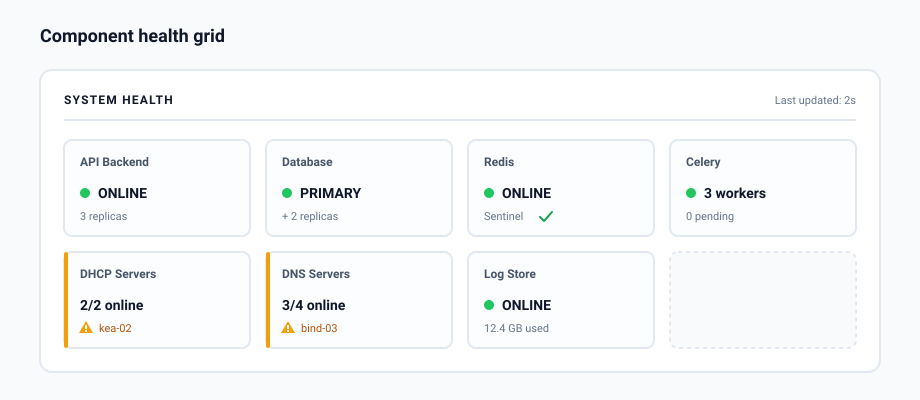

# System Administration Feature Specification

## Overview

SpatiumDDI includes a comprehensive **System Administration** panel accessible to superadmins. This covers platform-level configuration, service management, health monitoring, notifications, and backup/restore. The goal is that a full platform can be configured entirely from the UI — no manual file editing required in normal operations.

---

## 0. Operator surfaces shipped after `2026.04.16-1`

This document was originally written as a forward-looking spec.
Several admin surfaces have since landed; the rest of this file
remains the design reference for what hasn't shipped yet.

### Trash (`/admin/trash`) — landed in `2026.04.26-1`

Soft-delete + 30-day recovery for IP spaces, blocks, subnets,
DNS zones / records, and DHCP scopes (with their pools + static
reservations cascading under the scope's batch, so one Restore
brings the scope back whole — #617). See
[IPAM § 15.16](IPAM.md#-1516-soft-delete--trash-recovery) for
the full data model + cascade-batch semantics. The admin page
lists deleted rows newest-first with type / since / `q` filters,
per-row Restore (with conflict-detail rendering when a live row
would clash) and Delete-permanently buttons. Nightly purge sweep
is operator-configurable via
`PlatformSettings.soft_delete_purge_days`.

### Platform Insights (`/admin/platform-insights`) — landed in `2026.04.26-1`

Read-only diagnostic surface so operators can see what their
control plane is doing without standing up a separate Prometheus
/ pgwatch / Grafana pipeline. Five tabs:

- **Postgres** — version + DB size, cache hit ratio, current WAL
  position, active vs max connections, longest-running
  transaction (PID / age / state / query / app / client),
  per-table size with autovacuum lag, connections grouped by
  state with idle-in-transaction tinted amber, slow queries from
  `pg_stat_statements` if the extension is installed.
- **Redis** — overview, keyspace breakdown, and the agent-wake
  pub/sub bus state.
- **Containers** — per-container CPU% (computed the same way
  `docker stats` does), memory used / limit / %, network rx /
  tx, block-IO read / write. Default-filtered to the
  `spatiumddi-*` prefix; set the filter to empty to see every
  container on the host. Reports `available=false` with a
  one-line setup hint when `/var/run/docker.sock` isn't mounted
  into the api container.
- **Conformity** — promoted from the Compliance surface; shows
  the latest conformity-evaluation rollup.
- **Copilot Usage** — Operator Copilot token / cost observability.

Backend at `app/api/v1/admin/postgres.py` (5 endpoints) +
`app/api/v1/admin/containers.py` (1 endpoint) +
`app/api/v1/admin/redis.py` (3 endpoints). All
superadmin-gated.

---

## 1. System Health Dashboard

The main **Health Overview** page gives a single-pane-of-glass view of the entire platform.

### Component Health Grid

Each managed component shows a status card:

<p align="center">
  
</p>

### Per-Component Detail

Clicking any component opens a detail panel:

**Database:**
- Primary/replica status
- Replication lag (ms)
- Active connections / max connections
- Longest running query
- WAL archive status
- Last backup timestamp

**DHCP/DNS Servers:**
- Online/offline status per server
- Last successful sync timestamp
- Config version: IPAM DB version vs. pushed version
- Query rate (DNS), lease count (DHCP)
- Agent connectivity status

**Celery Workers:**
- Worker list with hostname, status, active tasks
- Queue depths per queue
- Failed task count in last hour

**Redis:**
- Sentinel / Cluster topology
- Memory usage
- Hit/miss ratio

### Service Start / Stop / Restart

From the Health Dashboard, superadmins can:
- **Start / Stop / Restart** any managed service (DHCP daemon, DNS daemon, Celery workers, API)
- **Force sync** any DHCP or DNS server (push current config immediately)
- **Test connectivity** to any backend server

Service control operations are executed via:
- **Docker/Compose**: Docker API calls to the container daemon
- **Kubernetes**: Rollout restart via Kubernetes API
- **Bare metal**: SSH to host, `systemctl start/stop/restart <service>`

All service control actions are **audit logged**.

---

## 2. System Configuration Sections

The System Configuration panel is organized into the following sections, each accessible via a settings menu.

### 2.1 Network Configuration (per node/container)

Configure the network settings for each SpatiumDDI node:

```
NodeNetworkConfig
  node_id
  interface: str         -- e.g., eth0, ens3
  ip_address: inet
  prefix_length: int
  gateway: inet
  dns_servers: inet[]
  search_domains: str[]
  mtu: int (default 1500)
  apply_method: enum(netplan, ifupdown, networkd, nmcli)
```

- Changes are applied via the SpatiumDDI agent on the target node
- Preview diff before applying
- Rollback available (reverts to previous config) if connectivity is lost after 60 seconds

### 2.2 Firewall Rules (per node/container)

Manage host firewall rules on SpatiumDDI nodes:

```
FirewallRule
  node_id (nullable — null = apply to all nodes)
  direction: enum(inbound, outbound)
  protocol: enum(tcp, udp, icmp, any)
  source_cidr: cidr (nullable)
  destination_cidr: cidr (nullable)
  port_range: str (nullable)   -- e.g., "80", "1024-65535"
  action: enum(allow, deny, log)
  priority: int
  description: str
```

Implemented via:
- **Linux**: `nftables` rules (preferred) or `iptables`
- **Containers**: Rules applied to Docker network or Kubernetes NetworkPolicy

Default ruleset (enforced, cannot be deleted):
- Allow: HTTPS inbound (443)
- Allow: API port inbound from configured management networks
- Allow: Prometheus scrape from monitoring network
- Allow: all established/related
- Deny: all other inbound

### 2.4 Users and Groups (Platform-Level)

Separate from IP-range-scoped permissions — this section manages:
- Local user accounts (create, edit, enable/disable, reset password, force MFA)
- Local groups (create, manage membership)
- LDAP / OIDC sync configuration:
  - Which LDAP OUs to sync groups from
  - Group attribute mapping
  - Sync interval
  - Manual "Sync Now" trigger
- Last login per user
- Active sessions (with revoke capability)

### 2.5 API Tokens

```
APIToken
  id, name, description
  token_hash: str        -- only hash stored; token shown once on creation
  scope: enum(global, user)
  user_id (FK, nullable) -- if user-scoped
  permissions: JSONB     -- optional restriction (e.g., read-only, specific resource types)
  expires_at: timestamp (nullable)
  last_used_at: timestamp
  created_by_user_id, created_at
  is_active: bool
```

- **Global tokens**: used for automation, CI/CD, Terraform providers — permissions are explicit
- **User tokens**: scoped to the creating user's permission set — cannot exceed user's own rights
- Tokens are displayed once on creation (PBKDF2 hash stored)
- Tokens can be scoped to specific API paths (e.g., `/api/v1/ipam/*` only)

### 2.6 Syslog / Log Forwarding

```
SyslogTarget
  id, name
  protocol: enum(udp, tcp, tcp_tls)
  host, port
  format: enum(rfc3164, rfc5424, json)
  facility: enum(local0..local7, daemon, syslog)
  severity_filter: enum(debug, info, warning, error, critical)
  tls_ca_cert: text (nullable)
  is_enabled: bool
  applies_to: [enum(api, agent, dhcp, dns, audit)]
```

Multiple syslog targets can be configured simultaneously (e.g., local Loki + remote SIEM).

### 2.7 Audit Log Settings

- Retention period (default: 365 days)
- Export audit log: date range → CSV or JSON download
- Archive to S3-compatible storage (optional)
- Audit log is append-only — no delete capability, even for superadmin
- Fields logged on every mutation: user, timestamp, source IP, action, resource, old value, new value

### 2.8 Statistics / Reporting

Dashboard tiles showing platform-wide stats:
- Total IP spaces / blocks / subnets / addresses
- Overall utilization heatmap
- Top 10 subnets by utilization
- DHCP lease counts by server
- DNS query rates by server
- Recent audit log summary (top actors, most-changed resources)
- Scheduled report configuration:
  - Report type (utilization, expiring leases, unused IPs)
  - Schedule (daily/weekly/monthly)
  - Output format (PDF, CSV, JSON)
  - Delivery method (email, webhook, S3)

### 2.9 Backup and Restore

The Backup admin page (`/admin/backup`) ships four tabs: **Manual** (build-and-download / restore-from-file), **Destinations** (configured remote targets, scheduling, restore-from-destination), **Restore Drills** (scheduled proof that an archive is actually restorable), and **Factory Reset** (per-section wipe back to defaults). Everything described here is reachable from the UI; the same surface is exposed via REST under `/api/v1/backup`, `/api/v1/backup/targets`, and `/api/v1/backup/drills` so operators can drive it from automation.

#### What's in the archive

A single `.zip` per backup, named `spatiumddi-backup-{hostname}-{YYYYMMDD-HHMMSS}.zip`:

| Member | Role |
|---|---|
| `manifest.json` | `app_version`, `schema_version` (alembic head), `hostname`, `created_at`, `dump_format` (`plain` or `custom`), `secret_passphrase_hint` |
| `database.dump` (or `database.sql` for Phase 1 archives) | Full `pg_dump --format=custom` of the SpatiumDDI database |
| `secrets.enc` | Operator-passphrase-wrapped JSON envelope carrying the source install's `SECRET_KEY` + `CREDENTIAL_ENCRYPTION_KEY` (PBKDF2-HMAC-SHA256 600k → AES-256-GCM) |
| `README.txt` | Human-readable note covering format, restore steps, version compatibility |

The archive is the unit operators move around — single-file, easy to ship over SCP / drop into S3 / download to a laptop.

#### Passphrase rules

Operators supply a passphrase at backup time (min 8 chars). The passphrase wraps the `secrets.enc` envelope so the source install's master key never lands in clear on disk anywhere. The same passphrase is required at restore. There's also a `passphrase_hint` field — a free-text label (max 200 chars) that's stored alongside the envelope so operators with multiple archives can remember which key decrypts which one.

The passphrase is **not** the destination's auth credential — every destination type has its own credential fields (S3 keys, SCP password / private key, Azure account key, etc.) which are Fernet-encrypted at rest in the `backup_target.config` JSONB.

#### Destination kinds

All eight destination kinds register in the same driver registry; the UI's destination picker reflects on `GET /backup/targets/kinds` so adding a new kind requires no frontend changes.

| Kind | Tier | Notes |
|---|---|---|
| `local_volume` | 1 | Filesystem path on the api/worker container — production deployments mount this as a docker / k8s volume so archives survive container recycle |
| `s3` | 1 | AWS S3 + S3-compatible (MinIO, Wasabi, Backblaze B2, Cloudflare R2, DigitalOcean Spaces) via the `endpoint_url` field |
| `scp` | 1 | SSH password *or* PEM private key auth (`paramiko`); SFTP write/read; per-call connection lifecycle (no pooling) |
| `azure_blob` | 1 | Azure Storage account via shared-key or full connection string |
| `smb` | 2 | Windows / Samba shares (`smbprotocol`); NTLM auth, optional SMB3 encryption toggle |
| `ftp` | 2 | Plain FTP / FTPS-explicit / FTPS-implicit; passive + active; `verify_tls` toggle for self-signed labs |
| `gcs` | 2 | Google Cloud Storage; service-account JSON key (encrypted at rest) — no ADC by design |
| `webdav` | 3 | WebDAV servers (Nextcloud, ownCloud, Apache `mod_dav`, IIS WebDAV, any RFC 4918 server) over `httpx` PUT / GET / PROPFIND / DELETE — no SDK dependency |

Every driver implements the same four operations: `write` / `list_archives` / `delete` / `download` + a `test_connection` probe (writes a 16-byte random payload, head/stats it, deletes it — same shape as the DNS / DHCP server probes).

#### Schedule + retention

Each target carries:

| Field | Behaviour |
|---|---|
| `schedule_cron` | 5-field UTC cron (`0 2 * * *` for "daily at 02:00 UTC"). Optional — leave blank for manual-only. |
| `retention_keep_last_n` | Keep the N newest archives matching the archive-name regex. |
| `retention_keep_days` | Drop archives whose mtime is older than N days. |
| `last_run_status` / `last_run_at` / `last_run_filename` / `last_run_bytes` / `last_run_duration_ms` / `last_run_error` | Surfaced inline on the target row. `last_run_status=in_progress` acts as a per-target mutex so a slow run can't double up on the next tick. |

Set exactly one of `retention_keep_last_n` / `retention_keep_days`, or neither for no auto-prune. A single Celery beat task (every 60 s) walks all enabled targets, checks each one against its `next_run_at`, and dispatches a one-off backup task per target that's due.

#### Manual triggers

| Action | Endpoint |
|---|---|
| Build + download a fresh archive | `POST /backup/create-and-download` (StreamingResponse, browser saves the zip directly) |
| Restore from a laptop-uploaded archive | `POST /backup/restore` (multipart upload) |
| Run a configured target now | `POST /backup/targets/{id}/run-now` |
| Test a configured target's connection | `POST /backup/targets/{id}/test` |
| List archives at a configured target | `GET /backup/targets/{id}/archives` |
| Restore from any archive at a target | `POST /backup/targets/{id}/archives/restore` |
| Download an archive from a target through the proxy | `GET /backup/targets/{id}/archives/{filename}/download` |

The proxy-download endpoint streams `driver.download(filename)` straight back to the operator's browser, so SCP / S3 / Azure / SMB / FTP / GCS / WebDAV archives can be pulled to a laptop without giving the operator the destination credentials.

#### Restore — what the server does

Same code path is hit whether the archive comes from an upload or a destination download.

1. **Pre-flight.** Validates archive shape, manifest `format_version` (1 or 2 currently), passphrase. The passphrase verify happens **before** any destructive step so a wrong passphrase is rejected up front.
2. **Pre-restore safety dump.** The current state of the database is snapshotted to `/var/lib/spatiumddi/backups/pre-restore-{ts}.zip` (passphrase `pre-restore-safety`). If the apply fails for any reason, the operator can roll back from this dump.
3. **Connection pool teardown.** SQLAlchemy's engine is disposed and `pg_terminate_backend` kicks every other connection so psql's `--clean` doesn't deadlock against the worker / beat / agents.
4. **Data replay.**
   - Phase 2+ archives (`dump_format: custom`) → `pg_restore --clean --if-exists --no-owner --no-acl --single-transaction --exit-on-error`.
   - Phase 1 archives (plain SQL) → `psql --single-transaction --set=ON_ERROR_STOP=1`.
   - Selective restore (operator ticked specific sections) → `TRUNCATE … RESTART IDENTITY CASCADE` for the selected sections' tables, then `pg_restore --data-only --disable-triggers --table=…` for just those tables. `platform_internal` (alembic_version + oui_vendor) always rides along.
5. **Alembic upgrade-on-restore.** If the archive's `schema_version` is older than this install's expected head, `alembic upgrade head` runs against the freshly-restored database. Same head → no-op. An archive whose head is **not in this install's chain** — i.e. taken on a newer build — is **refused up front, before any data is replayed**, so a database this build cannot migrate is never written (#781); the operator is told to upgrade SpatiumDDI here first. The head is taken from the manifest, falling back to the copy inside `secrets.enc`, so an archive that never recorded one in its manifest is still checked. The restore returns a `migration` block with `state` (`up_to_date` / `upgraded` / `incompatible_newer` / `unknown` / `failed`), `source_head`, `local_head`, `migrations_applied`.
6. **Cross-install secret rewrap.** Walks every Fernet-encrypted column in the schema plus every JSONB-embedded Fernet string (`backup_target.config`'s `__enc__:` fields, and on `platform_settings` the SNMPv3 passphrases, syslog TLS CA bundles, APT GPG keys and private-mirror passwords); decrypts each with the source key recovered from `secrets.enc`, re-encrypts with the destination's local key, UPDATEs in place. Same-install restores short-circuit with `same_install=true`. The operator does not have to copy the recovered `SECRET_KEY` into the destination's `.env` manually.

   Both lists in `app/services/backup/rewrap.py` are deliberately explicit rather than auto-discovered, so that adding an encrypted field is a review decision — and both are guarded, because "explicit" only works if drift is caught. It wasn't: the column list had silently drifted to 21 of 47 columns (#781). Everything a list misses stays encrypted under the *source* install's key, which surfaces only on first use of the affected credential. On the appliance this is the default case, not an edge case — `spatiumddi-firstboot` mints a fresh `SECRET_KEY` on every install, so every restore onto reimaged hardware is a cross-install restore.

   The two guards work differently because the two conventions do. `tests/test_rewrap_coverage.py` diffs `ENCRYPTED_COLUMNS` against the mapped metadata, which finds every `LargeBinary` column. That is structurally blind to the second convention — Fernet ciphertext stored as a *string* inside JSONB, which is neither `LargeBinary` nor named `*_encrypted` — so `tests/test_rewrap_jsonb.py` diffs `JSONB_ENCRYPTED_FIELDS` against the source instead: every `encrypt_str(...).decode(...)` call site in the app must be registered, that idiom being exactly the act of embedding ciphertext in a JSON-friendly field.
7. **Audit row.** Inserts a `backup_restored` row into the `audit_log` table on a fresh session — this row sits in the *restored* database (the trail of evidence survives the wipe), and carries the manifest, pre-restore safety path, migration counters, and rewrap counters.

The restore endpoint is superadmin-only. Operators must type the literal phrase `RESTORE-FROM-BACKUP` server-side to confirm, so accidental drag-and-drops don't nuke the install. Selective restore is opt-in via the section checklist on the restore modal.

#### Confirmation phrase + selective restore

Selecting "Selective restore" on the modal reveals a section checklist driven by `GET /backup/sections`. The checklist auto-ticks every non-volatile selectable section the first time the operator flips into selective mode; volatile sections (DHCP leases, DNS query log, DHCP activity log, nmap scan history, metric samples, Celery scratch) stay unticked by default but can be ticked individually. `platform_internal` is forced-on (alembic_version + oui_vendor are install-state, not user data, so they always ride along).

The UI surfaces a TRUNCATE-CASCADE warning on the selective panel because rows in *non-selected* sections that reference wiped data via foreign key are also removed. The reasoning is documented in the warning copy.

#### Cross-install rewrap counters

The restore response carries a `rewrap` block:

```jsonc
{
  "same_install": false,            // true when source + dest keys derive identically
  "rewrapped_rows": 7,              // column-level rewraps
  "rewrapped_jsonb_fields": 0,      // JSONB-embedded secret rewraps
  "skipped_idempotent_rows": 0,     // already-dest-key-decryptable (re-run / post-restore-created)
  "failed_rows": 0,                 // couldn't decrypt with either key — operator re-enters by hand
  "columns_visited": 52,            // every ENCRYPTED_COLUMNS entry + every JSONB_ENCRYPTED_FIELDS entry
  "failures": []                    // first 10 failures with table / column / pk / reason
}
```

Same-install restores return `{"same_install": true, ...counters all zero}`. The operator-facing `note` string adapts to the rewrap state ("no key rewrap was needed" / "re-encrypted N secret values" / "re-encrypted N, but K rows could not be decrypted with either key").

#### What's NOT in the archive

| Excluded | Why |
|---|---|
| DHCP daemon state (leases live in DB; binary state on the agent is regenerated from config) | Volatile — re-syncs from agents on next poll. Sectioned as `leases` (volatile) so operators can opt in for diagnostic backups. |
| DNS daemon state | All records live in DB; the BIND9 zone files are templated by the agent on apply. |
| DNS query log / DHCP activity log | Short-lived diagnostic data. Sectioned as `logs` (volatile). |
| nmap scan history | Often huge, regenerable. Sectioned as `nmap_history` (volatile). |
| Metric samples | Volatile, short retention. Sectioned as `metrics` (volatile). |
| Uploaded asset directory | Phase 2 polish — uploaded files (custom-field attachments, future logo overrides) aren't a separately-tracked path yet. |

#### Restore drills (issue #702)

A backup you have never restored is a hypothesis. The **Restore Drills** tab turns it into a fact: on its own schedule, SpatiumDDI downloads a target's newest archive, replays it into a throwaway database, runs a fixed assertion set against the result, and drops the throwaway database again.

**The live database is never written to.** The scratch database name is generated from a fixed `spatiumddi_drill_` prefix plus random hex — never from operator input — and is checked against the live database name before anything runs. The drill deliberately does not reuse the operator-facing restore path, which takes a safety dump and disposes the live connection pool; those behaviours are right for a real restore and wrong for an unattended background check.

| Check | What a failure means |
|---|---|
| `archive_available` | The destination holds no archives — there is nothing to restore from. |
| `archive_readable` | The zip is malformed, or its `format_version` is one this build cannot restore (checked against the same list the real restore path enforces, so a drill never green-lights an archive a restore would refuse). |
| `passphrase_opens_secrets` | The passphrase stored on the target does not open the archive's `secrets.enc`. A restore from it would be impossible. |
| `dump_replays_cleanly` | `pg_restore` / `psql` aborted — the dump is truncated or corrupt. |
| `alembic_version_present` | No single schema revision, or one this build has never heard of (the archive came from a newer SpatiumDDI). An archive *behind* the bundled head passes: a real restore migrates it forward. |
| `core_tables_populated` | The archive restored but came back with no users — an install restored from it would have no way in. |
| `audit_chain_intact` | The restored audit log's tamper-evident hash chain does not verify. Skipped when the restored schema isn't at the bundled head, because the ORM-based verifier would misread schema skew as tampering. Capped at 250k rows — a break inside that window is plenty to prove damage, and the nightly `audit_chain_verify` task walks the live table exhaustively. |

#### Requirements and costs

Two things a drill needs that a backup doesn't, both checked up front so a drill that can't run says so plainly instead of failing obscurely (and both report as `error`, not `failed` — see below):

- **`CREATEDB` on the database role.** The scratch database has to be created. On Kubernetes and appliance installs the umbrella chart grants this via CloudNativePG's `managed.roles` (`postgresql.cnpg.appRoleCreateDb`, default `true`), which reconciles onto existing clusters as well as new ones — the role CNPG's `initdb` creates has no `CREATEDB` and superuser access is switched off, so without the grant drills cannot run at all. On docker-compose the default `POSTGRES_USER` is a superuser and nothing is needed; if you run SpatiumDDI as a restricted role, grant it with `ALTER ROLE <user> CREATEDB;`.
- **Room for a second copy of the database.** The scratch database lands on the *same* Postgres instance, so a drill temporarily doubles the space the database occupies. Postgres offers no portable way to query the free space on its own data volume, so the risk is bounded from the other side: a drill refuses to run when the live database exceeds **20 GiB**. Raise `SPATIUM_DRILL_MAX_DB_BYTES` (bytes; `0` disables the guard) once you have confirmed the volume has room. Sizing this wrong is the one way a read-only verification job can cause a real outage — on the appliance's default 8Gi volume, a 6 GB install would fill it.

Scratch databases are dropped when the drill finishes, whatever the verdict. If a worker is killed outright — pod eviction, OOM, node drain — the drop never runs, so the drill sweep also reaps any `spatiumddi_drill_*` database with no active connections on its next tick.

**`failed` and `error` mean different things.** `failed` is a verdict about the archive — a real finding. `error` means the drill could not run at all (destination unreachable, missing `CREATEDB`, database over the size ceiling) and says nothing about the backup. Only `failed` opens the `restore_drill_failed` alert; an `error` leaves whatever the previous verdict was standing, which is the honest reading — you know no more than you did before.

Drills carry their own cron (`drill_enabled` / `drill_cron` on the backup target), separate from the backup schedule, because replaying a full dump costs far more than taking a backup. Weekly drills against nightly backups is the expected shape. The `restore_drill_failed` alert keys on the **target**, so a target failing every night holds one open event rather than opening a new one per drill, and auto-resolves when the target's next drill passes. It only considers enabled targets with drills scheduled — turning drills (or the target) off resolves an open event on the next tick, which is also the operator's way out if an ad-hoc drill against an unscheduled target ever fires one.

Two Operator Copilot tools cover the surface: `find_restore_drills` (history, filterable by verdict) and `get_restore_drill_readiness` (the per-target rollup answering "can I restore this install right now, and how do I know?"), the latter sharing its computation with the `Restore Drills` tab and `GET /api/v1/backup/drills/readiness` so the UI and the assistant cannot disagree. A target that has never passed a drill reports as *unverified* rather than healthy — an untested backup is an unknown, not a pass — while a target whose most recent drill merely errored keeps its previous verdict, since an error disproves nothing.

---

## 3. Notification Settings

Notifications are sent when system events occur.

### Notification Channels

```
NotificationChannel
  id, name
  type: enum(email, webhook, slack, teams, pagerduty)
  config: JSONB {
    -- email:
    smtp_host, smtp_port, smtp_user, smtp_password_ref, from_address, to_addresses[]
    -- webhook:
    url, method, headers, auth_type, auth_config, payload_template
    -- slack:
    webhook_url, channel, username
    -- teams:
    webhook_url
    -- pagerduty:
    routing_key, severity_mapping: JSONB
  }
  is_enabled: bool
  test_trigger: bool   -- POST to this endpoint triggers a test notification
```

### Notification Rules

```
NotificationRule
  id, name
  event_type: enum(
    subnet_utilization_threshold,   -- e.g., > 80%
    ip_allocated,
    ip_released,
    dhcp_server_offline,
    dns_server_offline,
    dhcp_sync_failed,
    dns_sync_failed,
    lease_pool_exhausted,
    discovery_conflict_found,
    backup_failed,
    audit_suspicious_activity,       -- e.g., bulk delete by non-admin
    certificate_expiring,
    blocklist_update_failed
  )
  conditions: JSONB    -- e.g., { "utilization_gt": 80, "subnet_id": "*" }
  channels: [NotificationChannel]
  cooldown_minutes: int   -- don't re-notify for same event within N minutes
  is_enabled: bool
```

### Email Configuration

Global SMTP settings (used by all email channels unless overridden):

```
SMTPConfig
  host, port
  use_tls: bool
  use_starttls: bool
  username, password_ref
  from_address, from_name
  reply_to: str (nullable)
```

---

## 4. Multi-Role Servers

A physical or virtual server can run **multiple SpatiumDDI service roles simultaneously**. The platform tracks this explicitly.

```
ManagedServer
  id, name, hostname, ip_address
  roles: [enum(api, worker, dhcp, dns, agent)]
  platform: enum(bare_metal, vm, docker, kubernetes_pod)
  os_info: JSONB         -- populated by agent heartbeat
  agent_version: str
  agent_status: enum(online, offline, stale)
  last_heartbeat_at: timestamp
  resource_metrics: JSONB {   -- populated by agent
    cpu_percent, memory_percent, disk_percent, uptime_seconds
  }
```

From the UI, a managed server card shows:
- All roles it is running
- Health of each role
- Resource usage
- Link to per-role configuration
- Start/stop individual roles

This allows a small deployment where one VM runs DHCP + DNS agents simultaneously, and the UI correctly represents that.

---

## 5. Maintenance Mode

Maintenance mode (issue #57) is a system-wide **read-only switch**, implemented as an ASGI middleware in [`backend/app/core/maintenance_mode.py`](../../backend/app/core/maintenance_mode.py) (`MaintenanceModeMiddleware`, wired in `app/main.py`). It is toggled by writing `PlatformSettings.maintenance_mode_enabled` / `maintenance_message` through the settings router (`PUT /api/v1/settings`); `maintenance_started_at` is server-stamped on enable and cleared on disable (it is never operator-set directly).

When maintenance mode is **on**:

- **Mutating requests** (`POST` / `PUT` / `PATCH` / `DELETE`) are answered with `503 Service Unavailable`, a `Retry-After: 120` header, and a structured body carrying `maintenance: true`, the configured `message`, and `started_at`.
- **Read requests** (`GET` / `HEAD` / `OPTIONS` / …) always pass through — the platform stays fully browsable.
- The frontend renders a maintenance banner / page from the same flag.
- **Agent connections are maintained.** The DNS / DHCP / supervisor agent endpoints are on the exempt allow-list (see below), so a maintenance window never severs an agent's config-caching path (non-negotiable #5) — DHCP / DNS keep serving from cache.

### Exempt paths

A mutating request to any of these prefixes flows through even while maintenance mode is on, so the operator can recover and agents stay connected:

| Prefix | Why |
|---|---|
| `/api/v1/auth` | Admins must be able to log in to recover |
| `/api/v1/settings` | The maintenance toggle itself lives here |
| `/health`, `/metrics` | Liveness / readiness probes + Prometheus scrape |
| `/api/v1/dns/agents`, `/api/v1/dhcp/agents` | Agent register / heartbeat / long-poll / op-ack |
| `/api/v1/appliance/supervisor` | Supervisor register / poll / heartbeat / k8s-proxy |
| `/api/v1/appliance/self-register-bootstrap` | Local-supervisor self-bootstrap pairing |

### Superadmin bypass

There is **no** `?bypass_maintenance=<token>` query parameter. The bypass is keyed off the request's `Authorization: Bearer …` credential: the middleware decodes the bearer (a JWT session token or an `sddi_`-prefixed API token), resolves the owning user, and lets the request through only when that user is an **effective superadmin**. Any failure — missing or invalid token, unknown / inactive user, revoked or expired session, an API token whose `scopes` don't cover this method+path — yields no bypass and the request still gets the 503. This lets an admin flip the switch back off and run recovery tasks while everyone else is held read-only.

Performance: the middleware reads the flag from a short-TTL process-local cache. When maintenance mode is off (the common case) a mutating request passes straight through with no bearer decode and no DB round-trip; the toggle endpoint calls `invalidate_cache()` so the flipping worker sees the change immediately and other workers converge within the cache TTL.

---

## 6. Platform Settings

`PlatformSettings` is a singleton table (always exactly one row, `id=1`), defined in [`backend/app/models/settings.py`](../../backend/app/models/settings.py). It backs the `/api/v1/settings` surface (`GET` + `PUT`). The model carries a large number of flat columns spanning branding, security, IPAM/DNS/DHCP defaults, scheduled-task gating, integrations, and per-appliance host-config (SNMP, NTP, APT, syslog, SSH, resolver, …). Below is a representative slice — every field named here is a real column; see the model for the full set.

**Branding**

```
app_title: str (default "SpatiumDDI")
app_base_url: str (default "") -- used to build OIDC/SAML redirect URLs; empty = derive from request
```

**IP allocation**

```
ip_allocation_strategy: str (default "sequential")  -- sequential | random
```

**Session / security**

```
session_timeout_minutes: int (default 60)
auto_logout_minutes: int (default 0)  -- idle session timeout; 0 = disabled
```

**Password policy** (issue #70 — flat columns, not a JSONB blob; validator + history in `app.services.password_policy`)

```
password_min_length: int (default 12)
password_require_uppercase: bool (default true)
password_require_lowercase: bool (default true)
password_require_digit: bool (default true)
password_require_symbol: bool (default false)
password_history_count: int (default 5)   -- 0 disables history checking
password_max_age_days: int (default 0)     -- 0 disables forced rotation
```

**Account lockout** (issue #71)

```
lockout_threshold: int (default 0)          -- 0 disables lockout
lockout_duration_minutes: int (default 15)
lockout_reset_minutes: int (default 15)
```

**Utilization thresholds**

```
utilization_warn_threshold: int (default 80)
utilization_critical_threshold: int (default 95)
utilization_max_prefix_ipv4: int (default 29)   -- exclude PTP/single-host subnets from reporting
utilization_max_prefix_ipv6: int (default 126)
subnet_tree_default_expanded_depth: int (default 2)
```

**Release checking**

```
github_release_check_enabled: bool (default true)
-- result columns written by the daily beat task:
latest_version: str | null
update_available: bool (default false)
latest_release_url: str | null
latest_checked_at: timestamp | null
latest_check_error: str | null
```

**DNS / DHCP defaults**

```
dns_default_ttl: int (default 3600)
dns_default_zone_type: str (default "primary")
dns_recursive_by_default: bool (default true)
dhcp_default_dns_servers: str[]
dhcp_default_domain_name: str (default "")
dhcp_default_lease_time: int (default 86400)
```

**Scheduled-task gating** (the Celery beat tick reads these every run, so cadence changes take effect without restarting beat)

```
dns_auto_sync_enabled / dns_auto_sync_interval_minutes / dns_auto_sync_delete_stale
reverse_dns_enabled / reverse_dns_interval_minutes        -- PTR auto-population (issue #41)
dhcp_pull_leases_enabled / dhcp_pull_leases_interval_seconds
oui_lookup_enabled / oui_update_interval_hours
soft_delete_purge_days (default 30)                       -- trash purge sweep
```

**Maintenance mode** (issue #57 — see [§5](#5-maintenance-mode))

```
maintenance_mode_enabled: bool (default false)
maintenance_message: str (default "")
maintenance_started_at: timestamp | null  -- server-stamped on enable, never operator-set directly
```

Other notable areas on the model (each a small cluster of columns): integration toggles (`integration_kubernetes_enabled`, `integration_docker_enabled`, …), Operator Copilot caps (`ai_per_user_daily_token_cap`, `ai_per_user_daily_cost_cap_usd`, `ai_tools_enabled`, …), audit-event forwarding (`audit_forward_syslog_*`, `audit_forward_webhook_*`), and the per-appliance host-config plane (`snmp_*`, `ntp_*`, `apt_*`, `syslog_*`, `ssh_*`, `resolver_*`, `lldp_*`, `timezone`, `console_mode`).

---

## 7. Version and Release Management

### Current Version Display

The current application version is displayed in the UI header bar and on the System Admin → About page. The version string follows **CalVer** format: `YYYY.MM.DD-N` where N is the release number for that date (starting at 1).

Examples: `2026.04.13-1`, `2026.04.13-2` (hotfix same day)

The version is injected at build time and exposed via:
- UI header (e.g., `v2026.04.13-1`)
- `GET /api/v1/version` — returns `{ "version": "...", "update_available": ..., "latest_version": ... }`

### GitHub Release Check

When `github_release_check_enabled` is true, SpatiumDDI periodically polls the GitHub Releases API for the latest release tag. If a newer version is available:
- A banner appears in the admin UI: "SpatiumDDI 2026.05.01-1 is available — view changelog"
- A notification is sent to configured notification channels if `notify_on_new_release` is enabled
- Superadmins can dismiss the banner or snooze for N days

The check is performed by the Celery beat scheduler (task: `app.tasks.update_check.check_github_release`). No personal data is sent — only a GET request to the public GitHub API.

```python
# API model
GET /api/v1/version
→ {
    "version": "2026.04.13-1",
    "update_available": true,
    "latest_version": "2026.05.01-1",  # null if up to date, check disabled, or check failed
    "latest_release_url": "https://github.com/spatiumddi/spatiumddi/releases/tag/2026.05.01-1",
    "latest_checked_at": "2026-04-13T02:00:00Z",  # null if never checked
    "release_check_enabled": true,
    "latest_check_error": null         # most recent error, if any
  }
```

---

## 8. Metrics Export

### Prometheus (built-in)

Available at `/metrics` when `prometheus_metrics_enabled=true`. Scraped by any Prometheus-compatible tool including Grafana Cloud.

### InfluxDB Export

SpatiumDDI can push metrics to InfluxDB (v1.x and v2.x) for Grafana dashboards:

```
InfluxDBTarget
  id, name
  version: enum(v1, v2)
  url: str                   -- e.g., http://influxdb:8086
  -- v1 fields:
  database: str
  username, password_ref
  -- v2 fields:
  org: str
  bucket: str
  token_ref: str             -- reference to encrypted secret
  measurement_prefix: str (default "spatiumddi_")
  push_interval_seconds: int (default 60)
  is_enabled: bool
```

**Metrics pushed to InfluxDB:**
- IP space/subnet utilization (current allocation %)
- DHCP lease counts per scope
- DNS query rates per server
- API request rates and latencies
- System health status per component

Multiple InfluxDB targets can be configured simultaneously (e.g., local InfluxDB + remote InfluxCloud).
